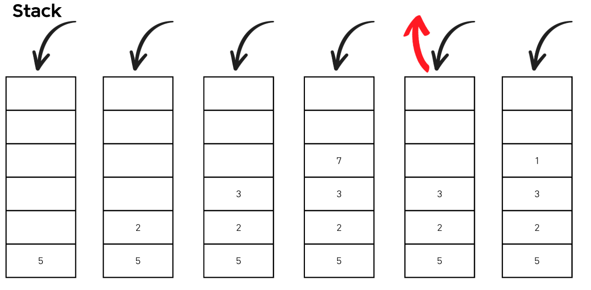
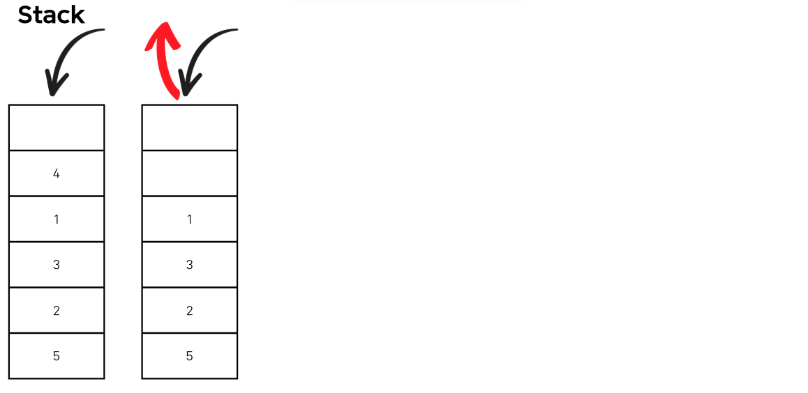
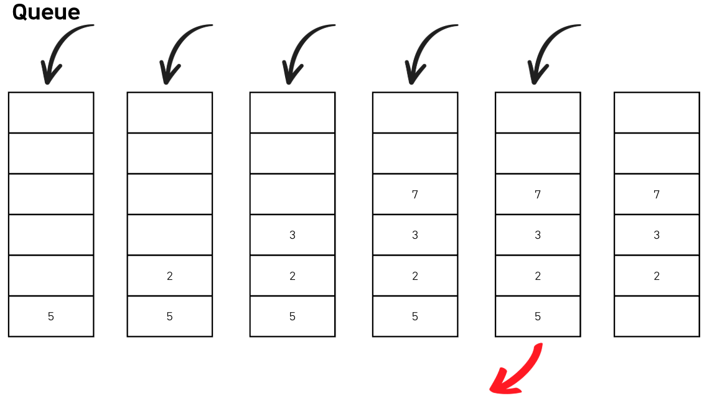

---
jupytext:
  formats: md:myst
  text_representation:
    extension: .md
    format_name: myst
    format_version: 0.13
    jupytext_version: 1.11.5
kernelspec:
  display_name: Python 3
  language: python
  name: python3
---

# Lecture 1-2. DFS/BFS 

그래프를 탐색하기 위한 대표적인 두 가지 알고리즘인 `DFS (Depth First Search)`와 `BFS (Breadth First Search)`에 대해서 학습한다. `탐색 (Search)`이란 많은 양의 데이터 중에서 원하는 데이터를 찾는 과정을 말한다. 이 개념을 위해서 사전적으로 `자료 구조 (Data structure)` `Stack`, `Queue`, `Recursive function`를 간단히 정리하고자 한다. 

## Preliminaries 
스택과 큐를 이해하기 위해서 두 핵심적인 함수 (push, pop) 및 underflow, overflow 개념을 알아야한다. 

- 삽입 (Push): 데이터를 삽입한다. 
- 삭제 (Pop): 데이터를 삭제한다. 
- 오버플로 (Overflow): 자료구조가 수용할 수 있는 데이터의 크기를 이미 가득 찬 상태에서 삽입 연산을 수행할 때 발생. 
- 언더플로 (Underflow): 데이터가 전혀 없는 상태에서 삭제 연산 수행할 때 발생 
  
### Stack 

스택은 `선입후출 (First In Last Out)` 또는 `후입선출 (Last In Last Out)`라고 한다. 파이썬에서는 스택을 이용할 때 별도의 라이브러리가 아닌 기본 리스트에서 `append()`와 `pop()` 메서드를 사용하면 된다. 

<div style="display: flex; justify-content: center;">
  
  
</div>

```python
stack = [] 
# 삽입 (5) - 삽입 (2) - 삽입 (3) - 삽입 (7) - 삭제 () - 삽입 (1) - 삽입 (4) - 삭제 ()

stack.append(5)
stack.append(2)
stack.append(3)
stack.append(7)
stack.pop()
stack.append(1)
stack.append(4)
stack.pop()

print(stack) # 최하단 원소부터 출력, [5, 2, 3, 1]
print(stack[::-1]) # 최상단 원소부터 출력 [1, 3, 2, 5]
```
### Queue 

큐 (Queue)는 대기줄에 비유할 수 있다. 먼저 온 사람이 먼저 들어가게된다. 이러한 구조를 `선입선출 (First In First Out, FIFO)`구조라고 한다. 파이썬으로 queue를 구현할 때는 collections 모듈에서 제공하는 deque 자료구조를 사용하면 된다. 또한 deque 객체를 리스트 자료형으로 변경하고자 하면, list() 메서드를 이용하면 된다. (list(queue))

<div style="display: flex; justify-content: center;">
  
  
</div>

```python
from collections import deque 

# Queue 구현을 위해 deque 라이브러리 사용 
queue = deque()

#삽입(5) - 삽입(2) - 삽입(3) - 삽입(7) - 삭제() - 삽입(1) - 삽입(4) - 삭제()
queue.append(5)
queue.append(2)
queue.append(3)
queue.append(7)
queue.popleft()
queue.append(1)
queue.append(4)
queue.popleft()

print(queue) # 먼저 들어온 순서대로 출력 (3,7,1,4)
queue.reverse() # 다음 출력을 위해 역순으로 바꾸기 
print(queue) # 나중에 들어온 원소부터 출력 (4, 1, 7, 3)
```

### Recursive Function 

`재귀 함수 (Recursive Function)`란 자기 자신을 다시 호출하는 함수를 의미한다. 다음은 재귀 함수의 예시를 살펴보자. 

