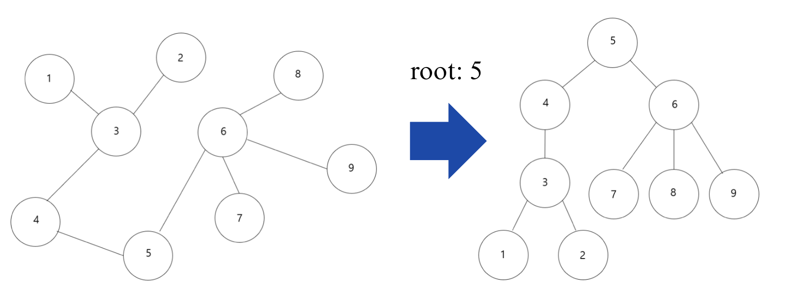
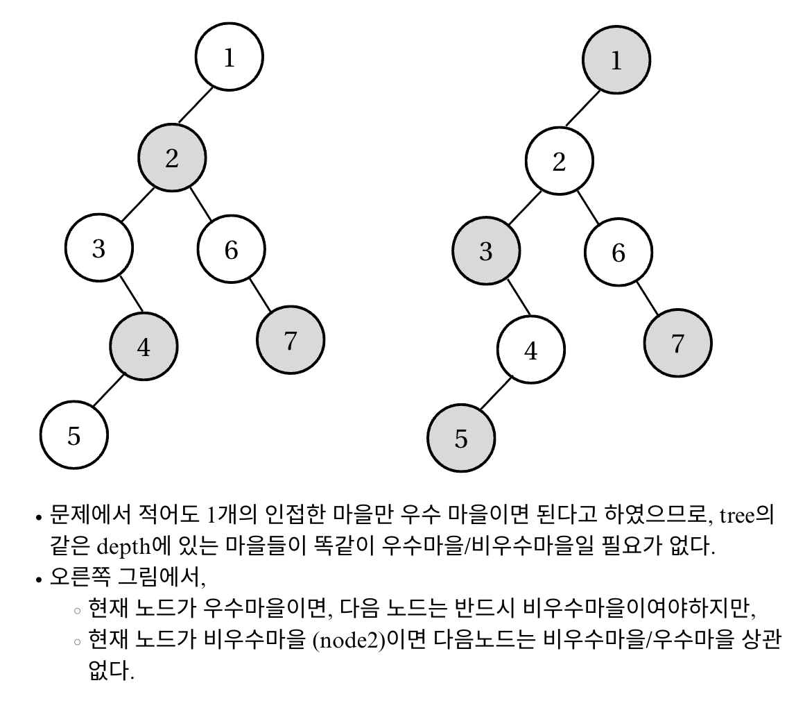

---
jupytext:
  formats: md:myst
  text_representation:
    extension: .md
    format_name: myst
    format_version: 0.13
    jupytext_version: 1.11.5
kernelspec:
  display_name: Python 3
  language: python
  name: python3
---
# Lecture 4-2. DP 실습

<!-- - DP 고득점 Kit 
  - [N으로 표현]()
  - [정수 삼각형]()
  - [등굣길]()
  - [사칙연산]()
  - [도둑질]() -->

- 코테 기출 
  - [색깔 트리](https://www.codetree.ai/ko/frequent-problems/samsung-sw/problems/color-tree/description)
    - [TreeDP 1: 서브트리에 포함된 정점의 개수 세기](https://www.acmicpc.net/problem/15681): [정답](https://wikidocs.net/272872)
    - [TreeDP 2](https://www.acmicpc.net/problem/1949): [정답](https://wikidocs.net/274552)
    - [TreeDP 3](https://www.acmicpc.net/problem/2533): [정답](https://wikidocs.net/273100)
  - [코드트리 메신저](https://www.codetree.ai/ko/frequent-problems/samsung-sw/problems/codetree-messenger/description)
  - [String Compression II](https://leetcode.com/problems/string-compression-ii/description/)

## 1번: 색깔 트리 
### TreeDP 1

````{admonition} Tree DP에서 Bottom-up 방식으로 구현하는 이유
:class: dropdown 

- **Tree DP는 보통 Bottom-up(post-order DFS)으로 구현한다.**  
  → 자식들의 값을 모두 구한 뒤 부모 값을 계산하는 구조이기 때문.  
- 경우에 따라 부모 정보를 자식에게 넘겨야 하는 문제는 Top-down(pre-order DFS)을 병행하기도 한다.  
- 따라서 Tree DP에서는 보통 `dfs(curr, parent)` 형태로 구현해,  
  parent-child 관계를 유지하며 DP 값을 계산한다.  
- 또한 기본적으로 "parent"와 "children"정보는 그래프를 받을 때 저장을 해놓야하는 정보이다. 

기본 post-order dfs는 다음과 같다. 

```{code-block} python
# u: 현재 노드, p: parent node 
def dfs(u, p):
    dp[u] = 1   # 자신도 자신을 루트로 하는 서브트리에 포함되므로 0이 아닌 1에서 시작한다.
    for v in graph[u]:
        # tree에서 현재 노드와 연결되어 있는 노드 중 p (부모)빼고는 모두 children이다.
        if v == p:
            continue
        dfs(v, u)             # 자식 처리
        dp[u] += dp[v]        # 자식 값 합치기
```

아래의 그림처럼, acyclic graph를 트리로 변환하는 함수를 구현할 수 있다. 



```{toggle}
'''
예시) 
9 5 8
1 3
4 3
5 4
5 6
6 7
2 3
9 6
6 8

'''
n, r, e = map(int, input().split())

graph = [[] for _ in range(n+1)]
children_list = [[] for _ in range(n+1)]
parent_list = [0] * (n+1)
visited = [False] * (n+1)
for _ in range(e):
    a, b= map(int, input().split())
    graph[a].append(b)
    graph[b].append(a)

# parent node가 r인경우 tree로 만들기, top-down (pre-order dfs)
def makeTree(cur_node, parent):
    visited[cur_node] = True 

    for node in graph[cur_node]:
        if node != parent and not visited[node]:
            makeTree(node, cur_node)
            children_list[cur_node].append(node)
            parent_list[node] = cur_node

# root에서 시작 
makeTree(r, 0)

print(f"parent list: {parent_list}")
print(f"children list: {children_list}")

```
````


````{admonition} makeTree and count_subtree
:class: dropdown 

```{code-block} python
# f = open('Input.txt', 'r')
n, r, q = map(int, input().split())

graph = [[] for _ in range(n+1)]
children_list = [[] for _ in range(n+1)]
parent_list = [0] * (n+1)
visited = [False] * (n+1)
dp = [0] * (n+1)

for _ in range(n-1):
    # print(_)
    a, b= map(int, input().split())
    graph[a].append(b)
    graph[b].append(a)

# parent node가 r인경우 tree로 만들기, top-down (pre-order dfs)
def makeTree(cur_node, parent):
    visited[cur_node] = True 

    for node in graph[cur_node]:
        if node != parent and not visited[node]:
            makeTree(node, cur_node)
            children_list[cur_node].append(node)
            parent_list[node] = cur_node

# root에서 시작 
makeTree(r, 0)

# print(f"parent list: {parent_list}")
# print(f"children list: {children_list}")
def count_subtree(cur_node, parent):
   dp[cur_node] = 1 

   for node in children_list[cur_node]:
       count_subtree(node, cur_node)
       dp[cur_node] += dp[node]

count_subtree(r, 0)

for _ in range(q):
    root = int(input())
    print(dp[root])
    
```
````

````{admonition} solution
:class: dropdown 

문제는 위에처럼 maketree와 count_subtree를 따로 만들면, 두번의 dfs를 거쳐야해서 타임 아웃이 된다. 이미 데이터를 받을 때, graph정보안에 하나의 parent빼고 모두 children을 담고 있으므로 이를 이용하여, maketree함수를 따로 만드는 대신, count_tree함수만 사용할 수 있다. 

```{code-block} python 
import sys
sys.setrecursionlimit(1_000_000)
input = sys.stdin.readline

n, r, q = map(int, input().split())

g = [[] for _ in range(n + 1)]
for _ in range(n - 1):
    a, b = map(int, input().split())
    g[a].append(b)
    g[b].append(a)

dp = [0] * (n + 1)
parent = [0] * (n + 1)

def dfs(u, p):
    parent[u] = p
    size = 1
    for v in g[u]:
        if v == p:
            continue
        size += dfs(v, u)
    dp[u] = size
    return size

dfs(r, 0)

out = []
for _ in range(q):
    u = int(input())
    out.append(str(dp[u]))
print("\n".join(out))

```
````

### TreeDP 2 

````{admonition} DP 설정
:class: dropdown 

이것을 DP로 구현하기 위해서 두 가지 경우를 생각하면 됩니다. 자신이 우수 마을인 경우와, 자신이 일반 마을인 경우 입니다.
첫 번째로 자신이 우수 마을이라면 자신의 자식 마을은 무조건 일반 마을이어야 합니다. 우수 마을끼리는 인접할 수 없기 때문에 자식 마을이 우수 마을일 수는 없습니다. 반대로 자신이 일반 마을이라면 자식 마을이 꼭 우수 마을일 필요는 없습니다. 부모 마을이 우수 마을이면 되기 때문 입니다.



위 그림에서 초록색은 우수 마을, 파란색은 일반 마을이라 생각해 보겠습니다. 1번이 우수 마을이라면 자신의 자식 마을인 2번, 3번은 반드시 일반 마을이어야 합니다. 반대로 2번이 일반 마을인 경우에는 자식 마을 4번, 5번이 우수 마을일 필요는 없습니다. 그림과 같이 6번, 7번이 우수 마을이기 때문에 조건에 위배되지 않습니다.
이와 같은 규칙으로 우리는 인구수가 최대한 많은 경우만 따져주면 됩니다.

즉,
- 현재 노드가 우수마을이면 자식 마을은 반드시 일반 마을 
- 현재 노드가 일반 마을이라면, 자식 마을은 일반 마을/우수 마을 둘 다 가능 


- state: dp[node] = the node id 
- what to store: (현재 노드가 우수 마을인 경우 'subtree'의 전체 인구수 , 현재 노드가 일반 마을인 경우 'subtree'의 전체 인구수)
- init: (num people of the node, 0)
- recurrence relation: 
    dp[parent][0] += dp[child][1]
    dp[parent][1] += max(dp[child][0], dp[child][1])

```{code-block} python
import sys
sys.setrecursionlimit(10**4)
input = sys.stdin.readline
mii = lambda : map(int, input().split())

N = int(input())
towns = [0] + list(mii())

tree = [[] for _ in range(N+1)]
for _ in range(N-1):
    u, v = mii()
    tree[u].append(v)
    tree[v].append(u)

visited = [False] * (N + 1)
dp = [[towns[i], 0] for i in range(N+1)]

def dfs(node):
    visited[node] = True 

    for child in tree[node]:
        if visited[child]:
            continue

        dfs(child)
        dp[node][0] += dp[child][1]
        dp[node][1] += max(dp[child][0], dp[child][1])

dfs(1) # 아무 노드나 root로 설정 
print(max(dp[1][0], dp[1][1]))

```
````

### TreeDP 3 


## 3번: String Compression II 

````{admonition} problems
:class: dropdown 

String Compression with Removal 

Strings with long blocks of repeating characters take up much less space if stored in a compressed representation. To obtain the  compressed representation, we replace each segment of equal characters in the string with the number of characters in the segment followed by the character. 

For example, 
- "CCCC" -> "4C" 
- A single character is left unchanged (e.g. "B" -> "B")
- "BC" -> "BC" (since there are no repeats)

<Example>
- The compressed representation of "ABBCCDDCCC" is "A3B2C2D3C".
- The compressed representation of "AAAAAAAAAABXXAAAAAAAAAA" is "11AB2X10A".

<Observation>
In the second example above, if we removed the "BXX" segment from the middle of the word before compression, we would obtain a much shorter compressed representation "21A". 

To take advantage of this, we modify our compression algorithm:
- Before compressing, we remove **exactly K consecutive letters** from the input string. 
- Then we compress the remaining stirng. 

We want to know the shortest compressed length possible after this operation. 

<Task>

Write a function `def solution(S, K):` that, given:

- a string S of length N,
- and an integer K,

return **the shortest possible length of the compressed representation of S** after removing exactly K consecutive characters. 

<Examples>

1. S = "ABBCCDDCCC", K = 3
    - Remove "DDC" → string becomes "ABBCCCC".
    - Compressed form = "A3B4C", length = 5.
    - Function should return 5.

2. S = "AAAAAAAAAABXXAAAAAAAAAA", K = 3
    - Remove "BXX" → string becomes "AAAAAAAAAAAAAAAAAAAAAA".
    - Compressed form = "21A", length = 3.
    - Function should return 3.

3. S = "ABCDDDDEFG", K = 2
    - Remove "EF" → string becomes "ABCDDDDG".
    - Compressed form = "ABC3DG", length = 6.
    - Function should return 6.

<Constraints>
- N is an integer within the range [1 .. 100,000]
- K is an integer within the range [0 .. 100,000]
- K <= N
- S consists only of uppercase English letters (A-Z)
````

