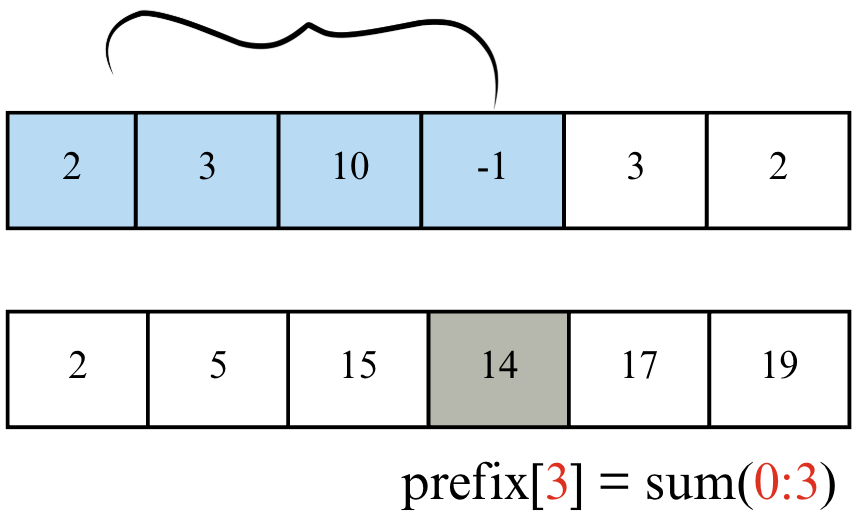
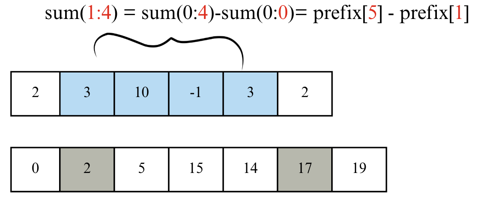
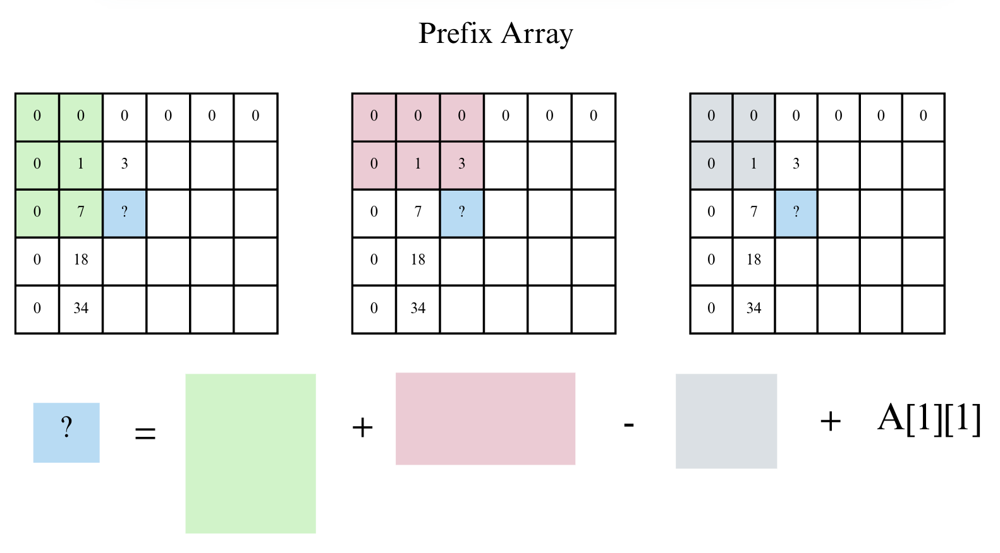
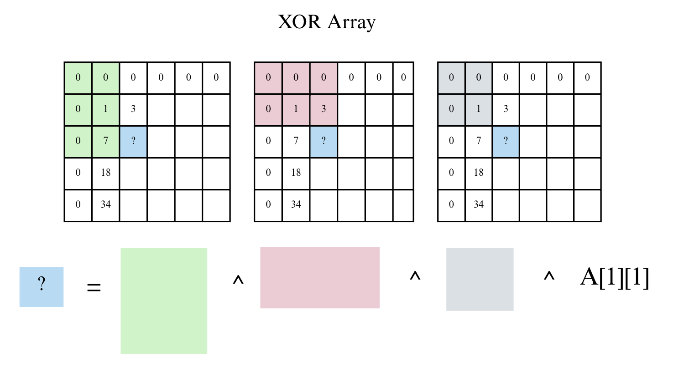

---
jupytext:
  formats: md:myst
  text_representation:
    extension: .md
    format_name: myst
    format_version: 0.13
    jupytext_version: 1.11.5
kernelspec:
  display_name: Python 3
  language: python
  name: python3
---

# Lecture 10-1. Prefix Sum (누적 합)

## 학습 목표

- Prefix(접두)의 의미를 이해한다.  
- 누적 합 배열(Prefix Sum Array)을 직접 구현한다.  
- 누적 합을 활용해 구간 합(range sum)을 빠르게 계산한다.  
- 2차원 누적 합 (Integral Image)의 정의와 구축 공식을 이해한다. 
- 직사각형 영역 합을 $O(1)$에 질의하는 방법을 익힌다. 
- Prefix XOR의 성질 (결합/교화/자기소거)을 이해하고, 구간 XOR/사각형 XOR 질의를 구현한다. 
- 해시맵을 이용해 "합/XOR이 특정 값이 되도록 하는 구간 개수"를 $O(N)$에 세는 패턴을 익힌다. 


## Prefix란?

**Prefix**는 “접두사”라는 뜻으로, 어떤 수열의 **처음부터 특정 위치까지의 부분 구간**을 의미한다.



예를 들어,  배열이 [1, 2, 3, 4]일 때  

| 구간 | 값 | 설명 |
|------|----|------|
| 첫 번째 원소까지의 합 | 1 | (1) |
| 두 번째 원소까지의 합 | 3 | (1 + 2) |
| 세 번째 원소까지의 합 | 6 | (1 + 2 + 3) |
| 네 번째 원소까지의 합 | 10 | (1 + 2 + 3 + 4) |

이렇게 “앞에서부터 누적된 합”을 담은 새로운 배열을 **Prefix Sum Array**라고 부른다.


### Prefix Sum 배열 구하기
````{admonition} 기본 소스 코드 
:class: dropdown

```python
data = [1, 2, 3, 4, 5]

n= len(data)
px = [0]*n

# px[i]: data[0] ~ data[i]까지의 함 (i is included)
for i in range(n):
    px[i] = px[i-1] + data[i]

print("Prefix Sum:", px)
```
출력: 
```bash
Prefix Sum: [1, 3, 6, 10, 15]
```
````

위의 코드에서는 prefix[i] = sum[i-1] + A[i]로 계산하였다. 하지만 보통은 아래와 같은 방식으로 prefix sum array를 계산한다. 문제 풀이 시에는 계산을 단순하게 하기 위해 보통 prefix 배열을 길이 N+1로 만들고, prefix[0] = 0으로 초기화한다. 즉, prefix[0]이 없는 경우, 

arr[0]~arr[3] 구간합 = px[3]
arr[1]~arr[3] 구간합 = px[3] - px[0]

으로 prefix[0]이 arr[0]을 포함하고 있어 인덱스 계산이 번거롭게 달라져 계산 실수할 수 있다. 


따라서 위의 그림처럼 prefix[0]= 0을 포함하여 일관성있게 0-based에서 [i:j]구간합을 prefix[j+1]-prefix[i]로 계산할 수 있게 코드를 구현한다.

````{admonition} Prefix 배열의 첫 번째 원소를 0으로 두기 
:class: dropdown

문제 풀이 시에는 계산을 단순하게 하기 위해 보통 prefix 배열을 길이 N+1로 만들고, prefix[0] = 0으로 초기화한다. 
즉, ***prefix[i]에는 인덱스 [0, i-1]까지의 누적합*** 이 저장된다. 

- prefix[1] = prefix[0] + data[0] → data[0]까지의 합
- prefix[2] = prefix[1] + data[1] → data[0] + data[1]까지의 합
- ... 
- prefix[i] = data[0]부터 data[i-1]까지의 합

```{code-block} python
arr = [1, 2, 3, 4, 5, 6, 7, 8, 9, 10]

def prefix_sum(arr):
    prefix = [0] * (len(arr)+1)

    for i in range(1, len(arr)+1):
        prefix[i] = arr[i-1] + prefix[i-1]

    return prefix 

def range_sum(prefix_arr, a, b):
    # a, b: index 
    '''
    [a, b] 모두 포함되어야하므로, 
    prefix_arr[b+1] = b 포함 
    prefix_arr[a] = a 전까지 더함 
    '''
    return prefix_arr[b+1] - prefix_arr[a]

prefix_arr = prefix_sum(arr)
a=1; b=3
print(f"Arr: {arr}")
print(f"Prefix: {prefix_arr}")
print(f"Sum from {a} to {b} is {range_sum(prefix_arr, a, b)}")
```
출력:
```bash
Arr: [1, 2, 3, 4, 5, 6, 7, 8, 9, 10]
Prefix: [0, 1, 3, 6, 10, 15, 21, 28, 36, 45, 55]
Sum from 1 to 3 is 9
```
````

### Prefix Sum을 왜 쓰는가? 구간합

어떤 구간의 합을 구해야할 때, 매번 for문을 돌면 $O(N)$이 걸린다. 하지만 prefix sum을 미리 계산하면 한 번의 뺄셈으로 구간 합을 $O(1)$에 계산 가능하다. 

아래 예시를 보자. 



\begin{gather*}
prefix[i] = \sum_{k=0}^{i-1} A[k]
\end{gather*}

구간 합 공식은 다음과 같다. <br>

배열 인덱스가 0부터 시작한다고 하고 0-based array에서 preifx[0]=0, len(prefix)= N+1인 prefix array를 이용한 (i, j)의 구간합은 아래와 같다. 

\begin{align*}
\sum(i, j) = prefix[j+1] - prefix[i] 
\\
단, i=0일 때는 단순히 \;prefix[j]
\end{align*}


## 실전 예시 

|문제 유형| 예시 |
|---|---|
| 1D 누적 합| 구간 합, 평균 구하기|
| 2D 누적 합 | 영역의 합 (e.g. 이미지 누적 밝기)|
| Prefix XOR | XOR 구간 연산 문제 | 
| Prefix Min/Max | 부분 최솟값, 최댓값 추적 |
| 문자열 Prefix | 접두사 비교, KMP 전처리 | 

````{admonition} Summary
:class: important 

"Prefix sum"

- 정의: 누적 합 배열로, 반복 계산을 한 번의 뺄셈을 줄여준다. 
    - 한 번 계산해두면, 구간 합을 $O(1)$에 처리 가능
- prefix_sum[j] = prefix_sum[j-1] + data[j-1]
- range_sum[i:j] = prefix_sum[j+1] - prefix_sum[i]
````

## 2D Prefix Sum 

1D에서 누적 합을 미리 구해 구간 합을 빠르게 계산하듯, 2D에서도 누적 합 테이블을 만들면 ***임의의 직사각형 영역의 합*** 을 한 번에 구할 수 있다. 컴퓨터 비전에서는 적분 영상(Integral Image)로도 불린다. 

### 패딩 (1-based) 정의

아래는 1-based prefix를 계산하는 과정이다. 

**Step 1**<br>

크게 헷갈리지 않도록 행/열 모두 1칸씩 0을 패딩해 P를 만든다. 
- 원본 행렬: A[1...H][1...W]
- 누적 합: P[0..H][0..W], 경계는 0 


**Step 2**<br>

나머지 prefix P 어레이의 빈칸은 어떻게 계산할 수 있을까? 


나머지 prefix[i][j]는 아래 수식으로 계산하여 채워놓으면 된다. 



\begin{align*}
P[y][x] = P[y-1][x] + P[y][x-1] - P[y-1][x-1] + A[y-1][x-1]
\end{align*}

````{admonition} Prefix P array for 2D matrix source code 
:class: dropdown 

```{code-block} python
import numpy as np 

A = np.arange(1, 13).reshape((3, 4))

def build_prefix_sum(array):
    N, M = len(array), len(array[0])
    P = [[0]*(M+1) for _ in range(N+1)] # zero padded 

    for y in range(1, N+1):
        for x in range(1, M+1):
            P[y][x] = array[y-1][x-1] + P[y-1][x] + P[y][x-1] - P[y-1][x-1]
    
    return P 

print(build_prefix_sum(A))
```
````

위와같이 prefix sum matrix을 구한후에 특정 영역의 직사각형 합을 구하는 경우에 여러번 다른 구간을 계산할때도 O(1) 시간 복잡도로 구할 수 있다. 


`````{admonition} prefix example 1 
:class: dropdown 

**예시 문제**<br>

아래 3x4 매트릭스 A 행렬의 (y1, x1) ~ (y2, x2) 영역의 직사각형 합을 구하여라 
\begin{align*}
A = 
\begin{bmatrix} 
1 & 2 & 3 & 4 \\
5 & 6 & 7 & 8 \\ 
9 & 10 & 11 & 12 \\
\end{bmatrix}
\end{align*}

````{toggle}
```python
import numpy as np 
from typing import List 

A = np.arange(1, 13)
# print(A)
A = A.reshape((3, 4))
# print(A)
# print(type(A))

def build_prefix2d(A: List[List[int]]) -> List[List[int]]:
    H, W = len(A), len(A[0])
    P = [[0]*(W+1) for _ in range(H+1)]

    for y in range(1, H+1):
        row = A[y-1]
        for x in range(1, W+1):
            P[y][x] = row[x-1] + P[y-1][x] + P[y][x-1] - P[y-1][x-1]
    
    return P 

# 1-bssed inclusive rectangle array 
def rect_sum(P: List[List[int]], y1:int, x1:int, y2: int, x2:int) -> int:
    return P[y2][x2] - P[y1-1][x2] - P[y2][x1-1] + P[y1-1][x1-1]


P = build_prefix2d(A)
print(rect_sum(P, 2, 2, 3, 4)) # 43 
```

````
`````

### 실전 문제 

[Baekjoon 11660](https://www.acmicpc.net/problem/11660)

<!-- ````{admonition} solution
:class: dropdown 


```` -->

````{admonition} 2D prefix range sum tip 
:class: tip

문제는 보통 (1-based)로 들어오므로 `P`를 (H+1)×(W+1)로 두고 경계 0을 고정하는 습관을 들이자. 0-based로 억지로 처리하면 경계 조건이 더 번거롭다.
````

## Prefix XOR

### XOR 

XOR (Exclusive OR) 은 ***두 값의 비트가 서로 다르면 1, 같으면 0***을 만드는 비트 연산이다. 

```{table} XOR 
:class: full-width-table
:widths: auto
:align: center 

| a | b | a ^ b |
|---|---|---|
| 0 |0|0|
|0|1|1|
|1|0|1|
|1|1|0|
```
다음과 같은 예시를 보자. 

```text
5 ^ 3 
5 = 101 (2진수)
3 = 011 (2진수)
-------------
    110 = 6
```

단순 합의 경우는 개수나 길이, 비용의 총합에 사용되지만 XOR은 언제 사용될까? 다음과 같은 용도가 있다. 

```{table} XOR의 용도
:class: full-width table 
:align: center 

| 연산 | 표현할 수 있는 개념|
| ---|---|
| Sum(+)| 개수, 길이, 비용, 총합|
| XOR(^) | 배열에서 하나만 남는 값 찾기, 비트 연산 알고리즘, 토글 변화 추적, 암호학|
```
예를 들어, 배열에서 모두 짝으로 등장하지만 단 하나만 혼자 나오는 값을 찾고 싶을 때, XOR을 사용하면 짝은 서로 소거되므로 쉽게 풀 수 있다. 또한 스위치를 on/off 토글할 때 "state ^= 1"로 UI, LED 제어 등 변경 등에서 많이 사용된다. 또한 XOR 는 정보 손실 없이 섞어낼 수 있는데, 아래와 같이 되돌림이 가능하다.  

```text
cipher = message ^ key
message = cipher ^ key (되돌림 가능!)
```

마지막으로 2D/1D 구간 XOR 질의에서 구간 합처럼 구간 XOR을 O(1)으로 계산할 수 있다. 

### XOR 성질 

```{table} XOR의 중요한 성질 
:class: full-width-table 
:align: center 

| 성질 | 의미 | 예시 |
|---|---|---|
|교환/결합 | 순서 상관 없음 | (a^b)^c = a^(b^c)|
| 자기 소거| 같은 값 두 번 XOR하면 사라짐 | a ^ a = 0|
| 항등원 | 0과 XOR하면 값 그대로 남음 | a ^ 0 = a | 
```

가장 중요한 성질은 ***XOR은 중복된 값을 없앤다*** 는 것이다. 이 성질을 이용하여 prefix XOR 배열을 만들 수 있다. 

### Prefix XOR 

아래와 같은 배열이 있을 때, 
```text
a = [3, 8, 2, 6]
```

1D prefix XOR 배열을 다음처럼 만든다고 하자: 

```text
px[i] = a[i] ^ a[2] ^ ... ^ a[i] (1-based 가정)
```
예를 들어, 
```text
px[1] = 3
px[2] = 3 ^ 8
px[3] = 3 ^ 8 ^ 2
px[4] = 3 ^ 8 ^ 2 ^ 6
```

여기서 구간 XOR (i...j) (i$<$j) 를 구하고 싶을때 어떻게 계산해야할까? 

```text
px[j] = a[1] ^ a[2] ^ ... ^ a[j]
px[i-1] = a[1] ^ a[2] ^ ... ^ a[i-1]
```
위의 둘을 XOR 하면, 

```text
px[j] ^ px[i-1]
= (a[1] ^ ... ^ a[j]) ^ (a[1] ^ ... ^ a[i-1])
```

XOR의 자기소거 특징에 의해, 공통 부분이 모두 사라진다. 따라서 다음만 남는다. 

```text
= a[i] ^ a[i+1] ^ ... ^ a[j]
= XOR(i..j)
```

따라서 구간 (i, j)의 XOR은 다음과 같이 구할 수 있다. 

\begin{align*}
XOR(i..j) = px[j]^px[i-1]
\end{align*}

즉, prefix XORd은 앞에서부터 XOR 값을 저장해두고 중복되는 앞부분을 XOR로 지워서 구간 XOR를 빠르게 구하는 방법이다. 
시간 복잡도는 전처리때 O(N)이 걸리고 각 질문마다 O(1)으로 딱 한 번 계산하기 때문에 속도가 빠르다. 


**예시 문제** <br>

```text
배열 a = [3, 8, 2, 6]에서 (2, 4)의 XOR은?

- P = [0, 3, 11, 9, 15] (편의상 앞에 0패딩)
- 답: P[4] ^ P[1] = 15 ^ 3 = 12 
```

````{admonition} XOR 정리
:class: note
**XOR 성질 복습** <br>
- 교환/결합: a ^ b = b ^ a, (a^b) ^ c = a ^ (b^c)
- 자기 소거: a ^ a =0, 
- 항등원: a ^ 0 = a 

따라서, 1D 배열에서 P[i] = a[i] ^ ... ^ a[i] (1-based)로 두면, 

\begin{align*}
\text{XOR}(i..j) = px[j] \;\hat{\ }\; px[i-1].
\end{align*}
````

````{admonition} Source code for prefix XOR 
:class: dropdown 

```{code-block} python 
from typing import List 

def build_prefix_xor(a: List[int]) -> List[int]:
    n = len(a) 
    px = [0] * (n+1)
    for i in range(1, n+1):
        px[i] = px[i-1] ^ a[i-1]
    return px 

def range_xor(px:List[int], i:int, j:int) -> int:
    # 1-based inclusive 
    return px[j] ^ px[i-1]

# quick self-test
arr = [3,8,2,6]
px = build_prefix_xor(arr)
print(range_xor(px, 2, 4)) # 12
```
````
## 2D Prefix XOR 



위의 그림을 보면, 1-based XOR array에서 (0,0) ~ (i, j) 까지 구간 XOR을 계산하려면 prefix sum을 계산할 때와 비슷하게 계산가능하다. 다만 이경우에는 모두 '^'로 처리해주면된다. 그림을 잘 살펴보면 구간 XOR에서 총 4개의 구간을 XOR 연산 시켜줬을 경우 모든 구간이 ***홀수번*** 만 반복되어 정확히 한번에 계산가능하다. 

\begin{align*}
PX[y][x] = A[y][x] \;\hat{\ }\; PX[y-1][x] \;\hat{\ }\; PX[y][x-1] \;\hat{\ }\; PX[y-1][x-1]
\end{align*}

아래 예시 문제를 보자. 

XOR이 K인 부분 배열의 개수를 구하고 싶다. 

즉, px[j] ^ px[i-1] = K ↔ px[i-1] = px[j] ^ K

````{admonition} solution
:class: dropdown 

```python
from collections import defaultdict


def count_subarrays_xor_k(a, K):
    ans = 0
    freq = defaultdict(int)
    freq[0] = 1
    running = 0
    for x in a:
        running ^= x
        ans += freq[running ^ K]
        freq[running] += 1
    return ans

# quick test
print(count_subarrays_xor_k([4,2,2,6,4], 6)) # 4
```
````

````{admonition} Summary 
:class: tip 

- 누적 합/ XOR 전처리: 1D는 $O(N)$, 2D는 $O(HW)$
- 질의: 1D/2D 모두 $O(1)$
- 개수 세기(맵): 한 번의 스캔 $O(N)$, 공간 $O(U)$ (서로 다른 prefix 값의 수)
````

## 문자열 Prefix 

## 연습 문제 

### 구간 합 구하기 4 
[Baekjoon 11659]

### 구간 합 구하기 5 
[Baekjoon 11660]

### Subarray Sum Equals K
[LeetCode 560]

### XOR Queries of a Subarray
[LeetCode 1310]
