---
jupytext:
  formats: md:myst
  text_representation:
    extension: .md
    format_name: myst
    format_version: 0.13
    jupytext_version: 1.11.5
kernelspec:
  display_name: Python 3
  language: python
  name: python3
---

# Lecture 5-1. Shortest Path

최단 경로 (Shotest Path) 알고리즘은 가장 짧은 경로를 찾는 알고리즘이다. 그래서 "길 찾기" 문제라고도 불린다. 최단 경로 알고리즘 유형에는 다양한 종류가 있다. 예를 들어 '한 지점에서 다른 특정 지점까지의 최단 경로를 구해야 하는 경우", "모든 지점에서 다른 모든 지점까지의 최단 경로를 모두 구해야하는 경우" 등의 다양한 사례가 존재한다. 각 사례에 맞는 알고리즘을 알고 있다면 좀 더 쉽게 풀 수 있다. 이번 챕터에서는 **다익스트라 최단 경로**와 **플로이드 워셔 알고리즘** 유형을 다룰 것이다. 

사실 이번 장에서 다루는 내용은 그리디 알고리즘 및 다이나믹 프로그래밍 알고리즘의 한 유형으로 볼 수 있다. 

## Dijkstra Algorithm 

다익스트라 (Dijkstra) 최단 경로 알고리즘은 그래프에서 여러 개의 노드가 있을 때, **특정한 노드에서 출발**하여 **다른 노드로 가는 각각의 최단경로**를 구해주는 알고리즘이다(출발: 1 -> 도착: the rest of the nodes). 또한 다익스트라 최단 경로 알고리즘은 '**음의 간선**'이 없을 때 정상적으로 동작한다. 따라서, 현재 세계의 길에서 간선은 음의 간선으로 표현되지 않으므로 GPS 소프트웨어의 기본 알고리즘으로 채택되곤 한다. 

````{admonition} Dijkstra Algorithm Conditions
:class: important
1. One Start Node -> The Rest of The Nodes 
2. All Integer Edge Weight 
````

````{admonition} Why no negative edge weight?
:class: attention 

다익스트라는 "현재까지 찾은 경로가 항상 최단이다"라는 가정을 사용한다. 하지만 음수 간선이 있으면, "나중에 더 짧은 경로가 등장할 가능성"이 생긴다. 이러면 이미 확정한 값이 틀릴 수 있기 때문에 알고리즘이 깨진다. 
````

Dijkstra Algorithm는 다음과 같은 원리를 따른다. 

1) 출발 노드를 설정한다.
2) **최단 거리 테이블**을 초기화한다. 
3) 방문하지 않은 노드 중에서 최단 거리가 가장 짧은 노드를 선택한다. 
4) 해당 노드를 거쳐 다른 노드로 가는 비용을 계산하여 최단 거리 테이블을 갱신한다. 
5) 위 과정에서 3), 4)번 과정을 반복한다. 

위의 Step 2)에서 최단 거리 테이블은 "각 노드에 대한 현재까지의 최단 거리" 정보를 저장한다. 또한 매번 현재 처리하고 있는 노드를 기준으로 주변 간선을 확인한다. 나중에 현재 처리하고 있는 노드와 인접한 노드로 도달하는 더 짧은 경로를 찾으면 "더 짧은 경로도 있었네? 이제부터는 이 경로가 제일 짧은 경로야"라고 판단하는 것이다. 따라서 "방문하지 않은 노드 중에서 현재 최단 거리가 가장 짧은 노드를 확인"해 그 노드에 대하여 4) 과정을 수행한다는 점에서 그리디 알고리즘으로 볼 수 있다. 

다익스트라 알고리즘을 구현할 때 느리지만 구현하기 쉬운 방법이 있고 구현하기 까다롭지만 빠르게 동작하는 방법이 있는데, 코딩 시험을 위해서 두 번째 방법을 당연히 숙지하고 있어야한다. 

````{admonition} 방문했다는 건 어떤 기준으로 정하는 지? 아직 모든 경로를 다 본 것이 아닌데 왜 고정하는가?
:class: attention 

다익스트라에서 방문(=최단 거리 확정)은 "남아 있는 후보 중에서 제일 짧은 거리"를 가진 정점이다. 음수 간선이 없다면, 이 정점으로 가는 더 짧은 길이 나올 수 없기 때문에 고정해도 안전하다. 
````
### Dijkstra Algorithm 예시 

다음과 같은 그래프가 있을 때, 1번 노드에서 다른 모든 노드로 가는 최단 경로를 구하는 문제를 생각해보자. 출발 노드는 1이라 가정한다. 즉, 1번 노드에서 다른 모든 노드로 가는 최단 거리를 계산할 것이다. 최단 경로 테이블을 보면, "**초기 상태에서는 다른 모든 노드로 가는 최단 거리**"를 "INF"로 초기화한다. 즉, 테이블의 각 값은 
**해당 노드로 도달하는 가장 짧은 값**"을 저장한다. 파이썬에서 기본으로 1e9를 실수 자료형으로 처리하므로 모든 간선이 정수형으로 표현되는 문제에서는 `int(1e9)`로 초기화한다. (대부분의 문제에서는 그래프의 간신 길이 정보를 줄 때 1억 미만의 값으로 준다.)

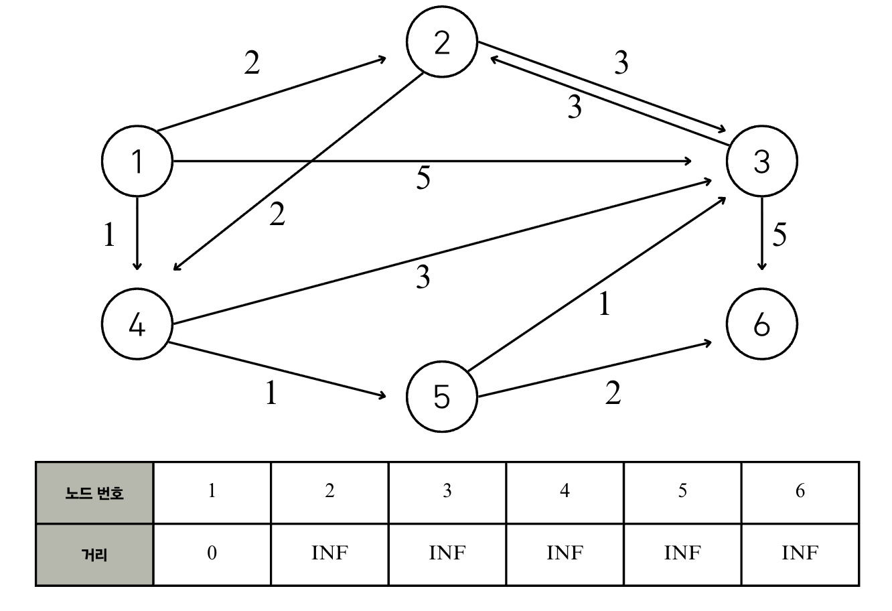


**Step 1** 

먼저 방문하지 않은 노드 중에서 최단 거리가 가장 짧은 노드를 선택하는데, "출발 노드에서 출발 노드"로의 거리는 0으로 보기 때문에, 처음에는 출발 노드가 선택된다. 

이제 1번 노드를 거쳐 다른 노드로 가는 비용을 계산한다. 1번 노드와 연결된 모든 간선을 하나씩 확인한다. 현재 1번 노드까지 오는 비용은 0이므로, 1번 노드를 거쳐 2번, 3번, 4번 노드로 가는 최소 비용은 차례대로 2(0+2), 5(0+5), 1(0+1)이다. 현재 2, 3, 4번 노드로 가는 비용이 '무한'이므로 세 노드에 도달하는 더 짧은 경로를 찾았으므로 각각 새로운 값으로 갱신한다. 

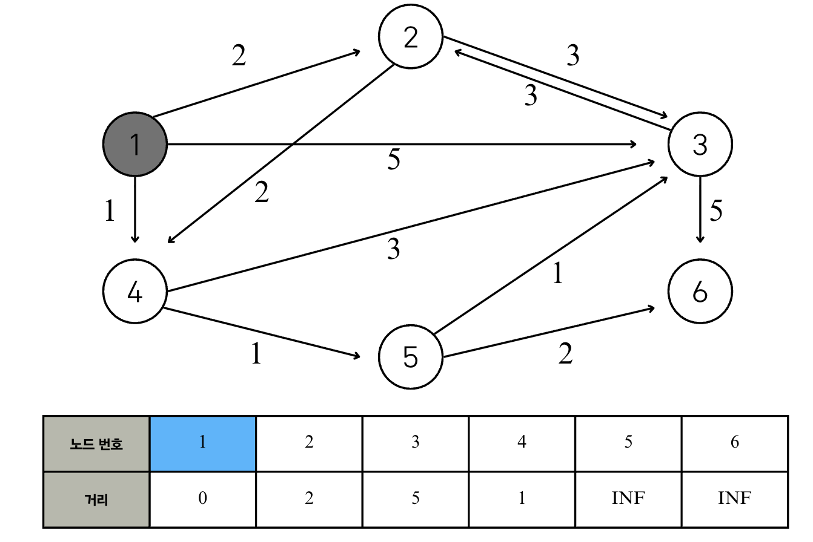

**Step 2**

이후의 모든 단계에서도 마찬가지로 방문하지 않은 노드 중에서 최단 거리가 가장 짧은 노드를 선택한다. 따라서 4번 노드가 선택된다. 이어서 4번 노드를 거쳐서 갈 수 있는 노드를 확인한다. 4번 노드에서 갈 수 있는 노드는 3번과 5번이고, 4번 노드까지의 거리는 1이므로 4번 노드를 거쳐서 3번과 5번 노드로 가는 최소 비용은 차례대로 4(1+3), 2(1+1)이다. 이 두 값은 기존의 리스트에 담겨 있던 값보다 작으므로 다음처럼 리스트가 갱신된다. 

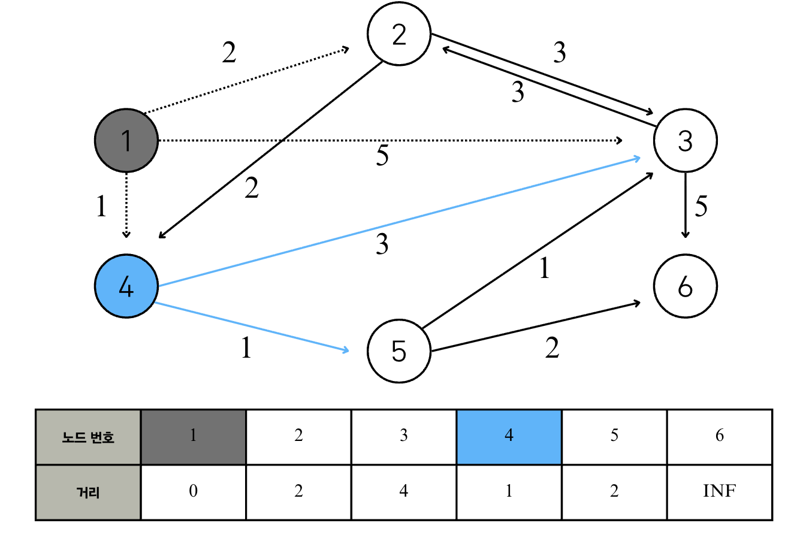

**Step 3**

방문하지 않은 노드 중 최단 거리가 가장 짧은 노드 선택: 2번 
2번 노드를 거쳐 갈 수 있는 노드들 중 방문하지 않은 노드들: 3번, 4번 
2번 노드를 거쳐 가는 경우 각 노드들까지의 최종 비용 계산: 3번 (2+3 vs. 4 -> 갱신 x), 4번 (2+2 vs. 1 -> 갱신 x)

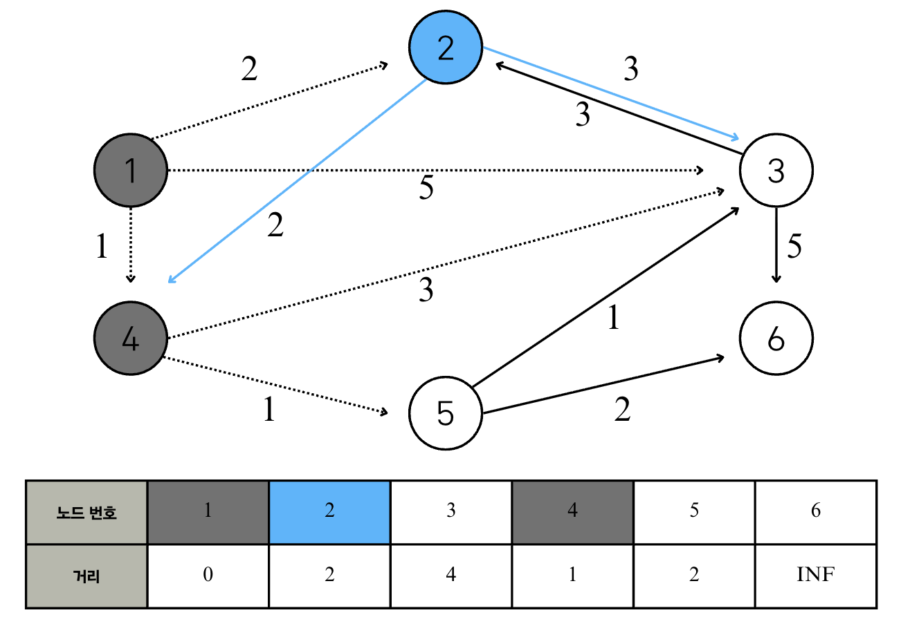

**Step 4**

방문하지 않은 노드 중 최단 거리가 가장 짧은 노드 선택: 5번 
2번 노드를 거쳐 갈 수 있는 노드들 중 방문하지 않은 노드들: 3번, 6번 
2번 노드를 거쳐 가는 경우 각 노드들까지의 최종 비용 계산: 3번 (2+1 vs. 4 -> 갱신), 6번 (2+2 vs. INF -> 갱신)

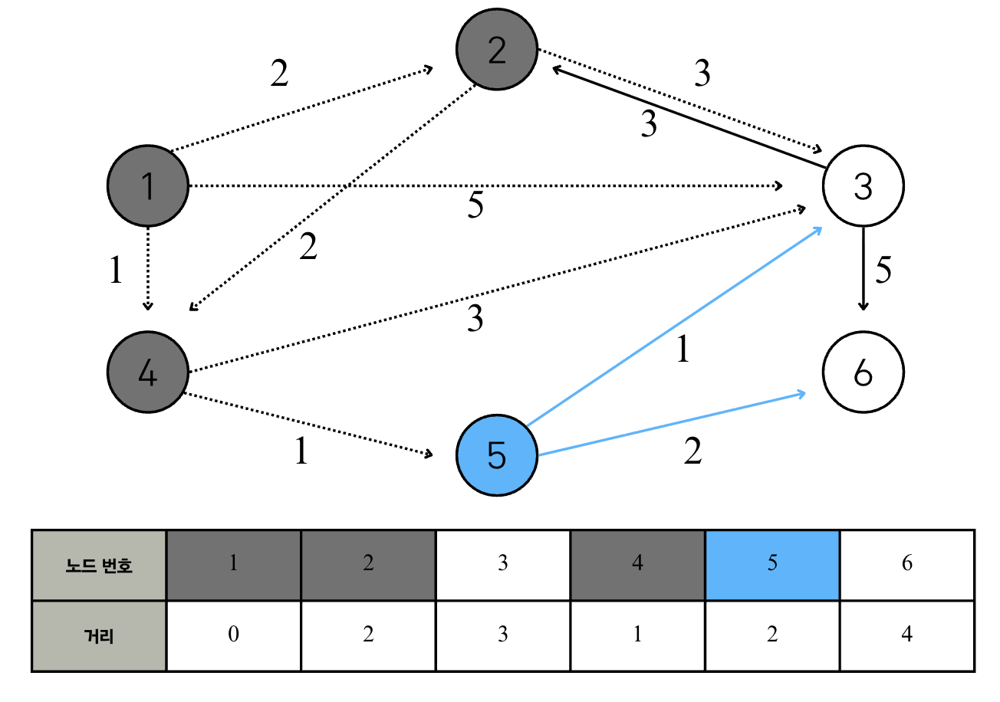

**Step 5**

방문하지 않은 노드 중 최단 거리가 가장 짧은 노드 선택: 3번 
2번 노드를 거쳐 갈 수 있는 노드들 중 방문하지 않은 노드들: 2번, 6번 
2번 노드를 거쳐 가는 경우 각 노드들까지의 최종 비용 계산: 2번 (3+3 vs. 4 -> 갱신 x), 6번 (3+5 vs. 4 -> 갱신 x)

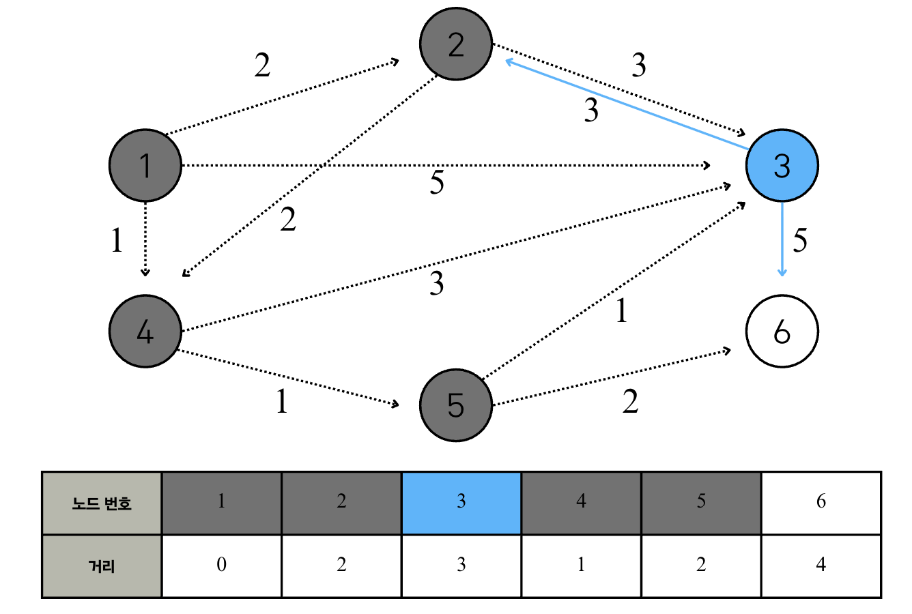

**Step 6**

방문하지 않은 노드 중 최단 거리가 가장 짧은 노드 선택: 6번 
2번 노드를 거쳐 갈 수 있는 노드들 중 방문하지 않은 노드들: x
2번 노드를 거쳐 가는 경우 각 노드들까지의 최종 비용 계산: x


**Summary**

최단 거리 테이블이 의미하는 바는 1번 노드 **(시작 노드)**로부터 출발했을 때 2번, 3번, 4번, 5번, 6번 노드까지 가기 위한 최단 경로 (비용 최단 경로) 가 각각 2, 3, 1, 2, 4라는 의미이다. 

다익스트라 최단 경로 알고리즘에서는 '방문하지 않은 노드 중에서 가장 최단 거리가 짧은 노드를 선택'하는 과정을 반복하는데, 이렇게 선택된 노드는 '최단 거리'가 완전히 선택된 노드이므로, 더 이상 알고리즘을 반복해도 최단 거리가 줄어들지 않는다. 앞서 [Step 6]까지의 모든 경우를 확인해보면 실제로 한 번 선택된 노드는 최단 거리가 감소하지 않는다. 예를 들어, [step 2]에서는 4번 노드가 선택되어서 4번 노드를 거쳐서 이동할 수 있는 경로를 확인했다. 이후에 [step 3] ~ [step 6]이 진행되었지만, 4번 노드에 대한 최단 거리는 더 이상 감소하지 않았음을 확인할 수 있다. 다시 말해 다익스트라 알고리즘은 **한 단계당 하나의 노드에 대한 최단 거리를 확실히 찾는 것**으로 이해할 수 있다. 즉, 이미 방문한 노드는 이후에도 테이블 값이 바뀌지 않는다. 

```{admonition} Dijkstra Summary
:class: important 

**개념**  
- 하나의 시작 노드에서 출발하여, *아직 방문하지 않은 노드 중 최단 거리 추정값이 가장 작은 노드*를 선택해 거리 테이블을 갱신.  
- 우선순위 큐(min-heap)에서 뽑힌 노드는 그 순간 최단 경로가 확정되며, 이후로는 갱신되지 않음.  

**구현 절차**  
1. 최단 거리 테이블을 `INF`로 초기화, 시작 노드는 0으로 설정.  
2. `heapq`에 `(거리, 노드)`를 넣고, 가장 작은 거리 순으로 노드를 꺼냄.  
3. 꺼낸 노드의 인접 노드를 확인 → 더 짧은 경로 발견 시 테이블 갱신 + 큐에 삽입.  
4. 큐가 빌 때까지 2~3 반복.  

**시간 복잡도**  
- `O(E log V)` (간선 E, 노드 V)  

```
## 간단한 다익스트라 알고리즘 구현 

시간 복잡도: O($V^2$), V=노드의 개수 
특징: 각 단계마다 **'방문하지 않은 노드 중에서 최단 거리가 가장 짧은 노드를 선택'하기 위해 매 단계마다 1차원 리스트의 모든 원소를 확인 (순차 탐색)** 한다. 

다음 소스코드에서는 입력되는 데이터의 개수가 많다는 가정하에 파이썬 내장 함수인 input()을 더 빠르게 동작하는 sys.std.readlin()으로 치환하여 사용하는 방법을 적용했다. 또한 모든 리스트는 (노드의 개수 +1)의 크기로 할당하여, 노드의 번호를 인덱스로 하여 바로 리스트에 접근할 수 있도록 했다. 

```python
import sys 

input = sys.stdin.readline 
INF = int(1e9)

# n=노드 개수, m=간선 개수 
n, m = map(int, input().split())
start = int(input())


visited = [False] * (n+1)
# 최단 거리 테이블 무한으로 초기화 
distance = [INF] * (n+1)

# 그래프 입력 받기 
graph = [[] for i in range(n+1)]
for i in range(m):
    # a에서 b노드로 가는 비용이 c 
    a, b, c = map(int, input().split())
    graph[a].append((b, c))


def get_smallest_node():
    min_value = INF 
    index = 0 # 가장 최단 거리가 짧은 노드 (인덱스)
    for i in range(1, n+1):
        if distance[i] < min_value and not visited[i]:
            min_value = distance[i]
            index = i 
    return index 


def dijkstra(start):
    # 시작 노드에 대해서 초기화 
    distance[start]= 0
    visited[start] = True 

    for j in graph[start]:
        distance[j[0]] = j[1] 


    # 시작 노드를 제외한 n-1개의 노드에 대해 반복 
    for i in range(n-1):
        # 현재 최단 거리가 가장 짧은 노드를 꺼내서, 방문 처리 
        now = get_smallest_node()
        visited[now] = True 

        # 현재 노드와 다른 연결된 노드 확인 
        for j in graph[now]:
            cost = distance[now] + j[1]
            
            # 현재 노드를 거쳐서 다른 노드로 이동하는 거리가 더 짧은 경우 
            if cost < distance[j[0]]:
                distance[j[0]] = cost 


# 다이익스트라 알고리즘 수행 
dijkstra(start)

# 모든 노드로 가기 위한 최단 거리 출력 
for i in range(1, n+1):
    # 도달할 수 없는 경우 
    if distance[i] == INF:
        print('INFINITY')
    else:
        print(distance[i])
```

```md
예시 그래프) 
6 11
1
1 2 2
1 3 5
1 4 1
2 3 3
2 4 2
3 2 3
3 6 5
4 3 3
4 5 1
5 3 1
5 6 2

출력 예시: 
0
2
3
1
2
4
```

전체 노드 개수가 5000개 이하라면, 일반적으로 이 코드로 문제를 해결할 수 있지만, 노드의 개수가 10,000개를 넘어가면 이 코드로 문제를 해결하기 어렵다. 따라서 개선된 다익스트라 알고리즘을 이용해서 풀어야한다. 

## 개선된 다익스트라 알고리즘 구현 

개선된 다익스트라 알고리즘을 사용하면, 최악의 경우에도 시간 복잡도 O(ElogV)를 보장하여 해결할 수 있다. 간단한 다익스트라 알고리즘은 '최단 거리가 가장 짧은 노드'를 찾기 위해 매번 최단 거리 테이블을 선형적으로 탐색했다. 이 과정에서 O(V)의 시간이 걸리는데, 선형적인 방법이 아니라 더욱 빠르게 찾아 시간 복잡도를 줄인다. 즉, ***힙(heap)*** 이라는 자료구조를 사용하여 특정 노드까지의 최단 거리에 대한 정보를 빠르게 찾을 수 있다. heap을 사용하면 로그 시간이 걸리기 때문이다. N=1,000,000일 때 $\log_{2} N$이 약 20인 것을 감안하면 속도가 획기적으로 빨라지는 것임을 이해할 수 있다. 

```{admonition} priority queue & heap 
:class: note 

즉, 일반 큐(queue)는 "먼저 들어온 순서대로" (FIFO) 데이터를 꺼내는 구조이고, 우선순위 큐(priority queue)는 값의 크기나 우선순위 (priority)에 따라 꺼내는 구조인데, 이때, "가장 높은 우선순위의 원소"를 빠르게 꺼낼 수 있어야하고 힙(heap)을 사용한다. ***힙(heap)*** 는 완전이진트리 (complete binary tree) 구조를 기반으로 ***정렬된 트리*** 로 최소 힙 (min-heap)의 경우 부모 <= 자식의 조건을 만족한다. ***우선순위 큐에서는 heappush(), pop()등을 수행해야하는데, 이러한 연산을 O(logN)으로 빠르게 하도록 힙을 이용하여 구현*** 한다. 즉, 우선순위 큐는 "개념"이고, 힙은 "구현체"이다. 
```
### 힙 (Heap) 자료 구조 

힙 자료구조는 우선순위 큐(Priority Queue)를 구현하기 위하여 사용하는 자료구조 중 하나이다. 큐 자료 구조는 가장 먼저 삽입한 데이터를 가장 먼저 삭제한다. 우선순위 큐는 **우선순위가 가장 높은 데이터를 가장 먼저 삭제한다**는 점이 특징이며 **우선순위 큐 구현에 최적화된 트리 기반 자료구조**이다. 우선순위 큐는 데이터를 우선순위에 따라 처리하고 싶을 때 사용한다. 예르 들어, 여러 개의 물건 데이터를 자료 구조에 넣었다가 가치가 높은 물건 데이터부터 꺼내서 확인해야하는 경우를 가정해보자. 

|자료구조| 추출되는 데이터|
|---|---|
|Stack| 가장 나중에 삽입된 데이터|
|Queue| 가장 먼저 삽입된 데이터|
|Priority Queue| 가장 우선순위가 높은 데이터|

파이썬에서는 우선순위 큐가 필요할 때 `PriorityQueue` 혹은 `heapq`를 사용할 수 있는데, 이 두 라이브러리는 모두 우선순위 큐 기능을 지원한다. 다만, PriorityQueue보다는 heapq가 더 빠르게 동작하기 때문에 수행 시간이 제한된 상황에서는 heapq를 사용하는 것을 권장한다. 

우선순위 값을 표현할 때는 일반적으로 정수형 자료형의 변수가 사용된다. 예를 들어 물건 정보가 있고, 이 물건 정보는 물건의 가치와 물건의 무게로만 구성된다고 가정해보자. 그러면 모든 물건 데이터를 (가치, 물건)으로 묶어서 우선순위 큐 자료구조에 넣을 수 있다. 이후에 우선순위 큐에서 물건을 꺼내게 되면, 항상 가치가 높은 물건이 먼저 나오게 된다. (우선순위 큐가 최대 힙 (max heap)으로 구현되어 있을 때 가정). 대부분의 프로그래밍 언어에서는 우선순위 큐 라이브러리의 데이터의 묶음을 넣으면, **첫 번째 원소**를 기준으로 우선순위를 설정한다. 따라서 데이터가 (가치, 물건)으로 구성된다면 '가치' 값이 우선순위 값이 되는 것이다. 이는 파이썬에서도 마찬가지이다. 

또한 우선순위 큐를 구현할 때는 내부적으로 최소 힙 (Min Heap) 혹은 최대 힙 (Max Heap)을 이용한다. 최소 힙을 이용하는 경우 '값이 낮은 데이터가 먼저 삭제'되며 최대 힙을 이용하는 경우 '값이 큰 데이터가 먼저 삭제'된다. 파이썬 라이브러리에서는 기본적으로 `Min Heap`을 이용하는데, 다익스트라 최단 경로 알고리즘에서는 비용이 적은 노드를 우선 방문하므로 최소 힙 구조를 기반으로 하는 파이썬의 우선순위 큐 라이브러리를 그대로 사용하면 적합하다. 

최소 힙을 최대 힙처럼 이용하려면 일부러 우순순위에 해당하는 값에 음수 부호(-)를 붙여서 넣었다가, 나중에 우선순위 큐에서 꺼낸 다음에 다시 음수 부호 (-)를 붙여서 원래의 값으로 돌리는 방식을 사용할 수 있다. 

|우선순위 큐 구현 방식| 삽입 시간| 삭제 시간|
|---|---|---|
|리스트| O(1) | O(N)|
|힙(Heap)| O(logN)| O(logN)|

````{admonition} Heap Data Structure 
:class: important

힙(Heap) 자료구조는, 

- 완전 이진 트리(Complete Binary Tree) 형태를 가지는 자료구조.
- 규칙: 부모 노드와 자식 노드 간에 우선순위 규칙이 있음. (불변식)
  - 최대 힙(Max Heap): 부모 ≥ 자식 (루트가 가장 큼).
  - 최소 힙(Min Heap): 부모 ≤ 자식 (루트가 가장 작음).
- 기본 연산:
  - 삽입 (push): 새 원소를 추가한 후 위로 올려 정렬해야함. 
  - 삭제 (pop): 루트 원소를 빼낸 후, 마자막 원소를 루트로 올려보내고 아래로 내려 정렬함. 

````

```{code-block} python
import heapq

# 빈 힙 생성
pq = []

# 삽입 (push)
heapq.heappush(pq, 5)
heapq.heappush(pq, 2)
heapq.heappush(pq, 8)

# 삭제 (pop, 가장 작은 값 반환)
print(heapq.heappop(pq))  # 2
```

#### 힙 문법 
```python

"""힙에 원소를 합입할 때는 heapq.heappush() 메서드를 사용하고, 힙에서 원소를 꺼내고자 할 때는 heapq.heappop() 메서드를 이용한다. 힙 정렬 (heap sort)을 heapq로 구현하는 예제를 통해 heapqd의 사용방법을 알아보자. 
"""
import heapq 

def heapsort(iterable):
  h = []
  result = []

  # 모든 원소를 차례대로 힙에 삽입 
  for value in iterable:
    heapq.heappush(h, value)
  # 힙에 삽입된 모든 원소를 차례대로 꺼내어 담기 
  for _ in range(len(h)):
    result.append(heapq.heappop(h))

  result = heapsort([1, 3, 5, 7, 9, 2, 4, 6, 8, 0])
  print(result)
```

#### 힙 구현

````{admonition} 부모, 자식 인덱스
:class: dropdown 

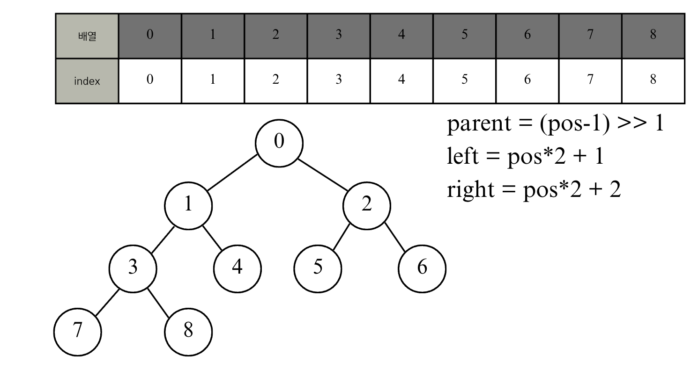

- parent = (pos - 1) // 2 # (pos-1) >> 1 
- left = 2 * pos + 1
- right = 2*pos + 2 
````

````{admonition} min heap visualization 
:class: dropdown 

- `_siftdown`: 힙 연산에서 "내려보내기 (sift down)" 과정을 나타냄. 
    - min heap: 힙의 불변식 (invariant)은 "부모 노드가 자식 노드보다 작다"의 경우 
    - 새로운 원소를 힙에 삽입하면, 처음에는 마지막 (leaf) 자리에 들어가고, 그 원소가 부모보다 작은 경우에는 부모와 자리를 바꿈. 
        - 부모 > newitem -> 부모를 아래로 내린다. 
        - pos <- 부모 위치로 이동 
        - 즉, 부모들을 한 단계씩 밑으로 "내려보내고" 마지막에 newitem을 넣는 구조이다. 
    - 루트에 도달하거나 부모 <= newitem이면 멈춘다. 
    - 현재 위치에 newitem을 둔다. 
    - ex) [1, 3, 19, 2] -> 2 < 3 이므로  3을 아래로 내림. -> [1, 2, 19, 3]
- `_siftup`: 자식들을 따라 "위로 올려보내면서" 원소를 정리하는 과정 
    - 루트를 pop할때 마지막 원소를 루트 자리로 옮기고, 이제 루트에서부터 힙 규칙이 깨질 수 있으므로 아래로 내려가면서 정렬한다. 
    - root에서 시작해서 자식을 따라 내려가면서 위치를 바꾸고, 마지막에 newitem을 넣은 후 위로 올려보내는 과정 
    - 알고리즘  
        - root 자리에 new item을 둔다. 
        - 자식 노드 중 더 작은 자식을 고른다. 
        - 그 자식 < newitem이면, 자식을 위로 올린다.
            - pos <- 자식 위치로 이동 
        - 자식 >= newitem이거나 leaf에 도달하면 멈춘다. 
        - 현재 위치에 newitem을 둔다.
    - 예시 
        - step 1: pop root=1, last =3 -> 루트에 3 대입 [3, 2, 19]
        - step 3: 자식 중 작은 건 2. (2 < 3) 자식 2를 위로 올림. 

click the [link](https://www.cs.usfca.edu/~galles/visualization/Heap.html)

- _siftdown 예시 
    - 삽입: 5, 3, 8, 1, 6, 7, 2
- _siftup 예시
    - 현재 힙 [1, 2, 5, 3, 6, 8, 7] -> root 삭제 
    - buildHeap button -> remove smallest 

````
````{admonition} 힙 구현 
:class: dropdown 

주의!
- heappush() → _siftdown 호출
    - 하지만 이 함수는 “부모와 비교하면서 위로 올리는(= percolate up)” 동작을 해.
    - 즉, 삽입 = 위로 올리기(sift-up) 가 맞음.
    - 단지 CPython의 함수 이름이 역사적으로 _siftdown을 사용함.(이름과 실제 동작 방향이 반대처럼 보임)

- heappop() → _siftup 호출
    - 루트에 마지막 원소를 올린 뒤, 자식과 비교하며 아래로 내리는(= percolate down) 동작을 해.
    - 즉, 삭제 = 아래로 내리기(sift-down) 가 맞음.
    - 마지막에 heap[pos] = newitem 한 다음 _siftdown(heap, 0, pos) 를 한 번 더 호출하는 건, 동점/부모-자식 비교의 경계 케이스에서 힙 불변식을 더 깔끔히 보장하려는 테크닉이야.

- 함수 동작 매핑 (개념 ↔ CPython 이름)
    - 개념적 sift-up(위로 올리기) ⟷ heapq의 _siftdown
    - 개념적 sift-down(아래로 내리기) ⟷ heapq의 _siftup

```{code-block} python
---
caption: python standard library에서 제공하는 heapq의 구현 방식을 참고하였다. 
---
def heappush(heap, item):
    heap.append(item)
    _siftdown(heap, 0, len(heap) - 1)

def _siftdown(heap, root, pos):
    newitem = heap[pos] # newitem 값 저장 
    while pos > root:
        parent_pos = (pos-1) >> 1 
        if heap[parent_pos] > newitem: # 항상 newtiem과 부모를 비교해야함. 
            heap[pos] = heap[parent_pos] # 부모를 한 칸 내려보냄 
            pos = parent_pos
            continue 
        break 
    # SWAP 
    heap[pos] = newitem 

def heappop(heap):
    # 맨 "마지막 원소"를 제거: heap안의 원소가 하나라면 맨 처음 원소이고, 아니라면 root position에 갈 원소가 됨. 
    removed_item = heap.pop() # heap이 비어있으면 에러를 일으킴 
    if heap: # pop 이후에도 heap안에 item이 있는 경우 
        returnitem = heap[0]
        heap[0] = removed_item 
        _siftup(heap, 0)
        return returnitem 
    return removed_item 

def is_leaf(heap, pos):
    # time complexity for len(list) = O(1), 내부에 길이를 따로 저장하고 있음.
    # "왼쪽 자식 인덱스가 배열 길이보다 크거나 같은 경우"로 판정하면 충분 
    return (pos * 2) + 1 >= len(heap)
  

def _siftup(heap, pos):
    end = len(heap)
    newitem = heap[pos]
    child = 2* pos + 1 # 왼쪽 자식 

    while child < end: # is_leaf()와 동일한 형식   
        right= child + 1 
        # 더 작은 자식을 child로 선택 
        if right < end and heap[right] < heap[child]:
            child = right 
        
        # child가 newitem보다 작으면 child를 끌어올리고, pos를 child로 이동 
        if heap[child] < newitem:
            heap[pos] = heap[child] # child를 siftup 
            pos = child 
            child = 2 * pos + 1 
        else:
            break # newitem이 들어갈 자리이면 멈춤 

    
    heap[pos] = newitem 
    _siftdown(heap, 0, pos)

if __name__ == "__main__":
    heap = []
    heappush(heap, (1, 2))
    heappush(heap, (3, 1))
    heappush(heap, (19, 1))
    heappush(heap, (2, 1))

    for i in range(len(heap)):
        print(heappop(heap))

```
````


### 우선순위 큐를 이용한 단계별 문제 풀이 

**Step 1**

1번 노드가 출발 노드인 경우를 가정했을 때, 앞의 과정과 다른 것은 우선순위 큐를 따로 만들어 1번 노드를 넣는 것이다. 파이썬에서는 간단히 튜플 (0, 1)을 우선순위 큐에 넣는다. 파이썬의 heapq 라이브러리는 원소로 튜플을 입력받으면 **튜플의 첫 번째 원소를 우선순위 큐로 구성**한다. 따라서 (거리, 노드 번호) 순서대로 튜플 데이터를 구성해 우선순위 큐에 넣으면 거리순으로 정렬된다. 

다시 말하지만, 다익스트라는 **현재까지 발견된 최단 거리 후보들**을 계속 관리하는 알고리즘이다. 현재 방문하는 노드의 모든 인접 노드를 확인하고, **짧아진 경우에만** 전부 큐에 넣어야 합니다.

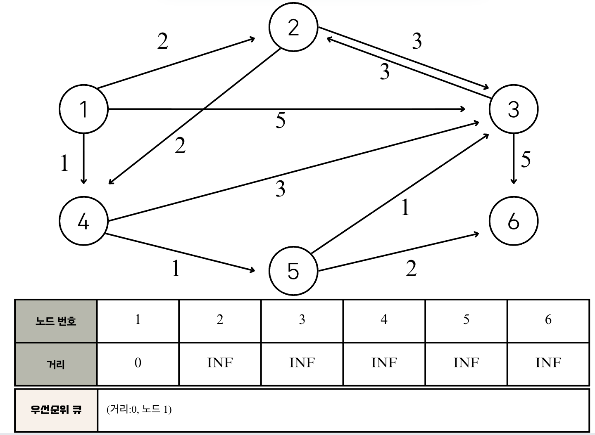

**Step 2**
우선순위 큐를 이용하고 있으므로 거리가 가장 짧은 노드를 선택하기 위해서는 우선순위 큐에서 그냥 노드를 꺼내면 된다. 따라서 우선순위 큐에서 노드를 꺼낸 뒤에 **해당 노드를 이미 처리한 적이 있다면** 무시하면 되고, 아직 처리하지 않은 노드에 대해서만 처리하면 된다. Step 1의 우선순위 큐에서 원소를 꺼내면 (0, 1)이 나오고, 1번 노드를 거쳐서 2번, 3번, 4번 노드로 가는 최소 비용을 계산한다. 각각 테이블 값을 갱신한 후, 더 짧은 경로를 찾은 노드 정보들은 다시 우선순위 큐에 넣는다. 
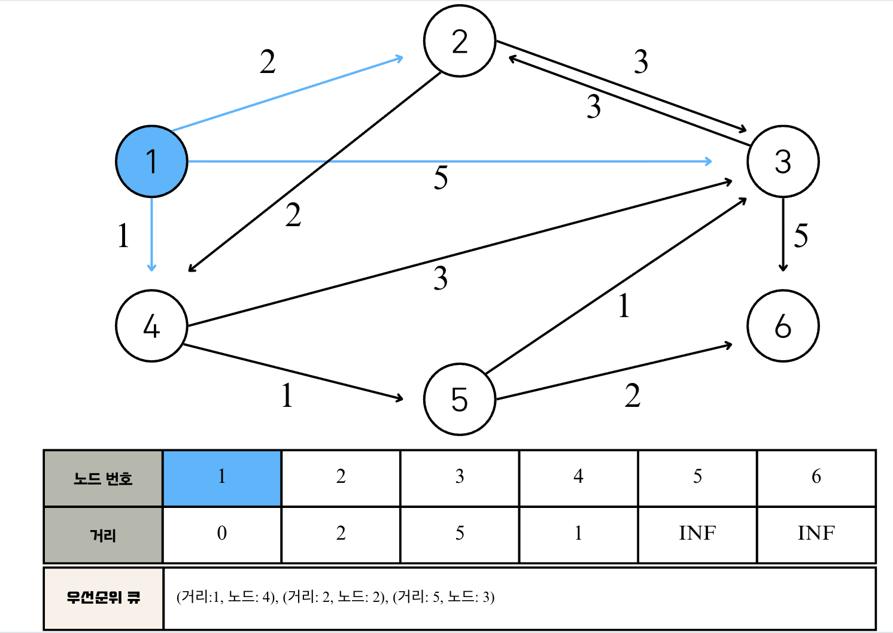

**Step 3**
다음으로 (1, 4)의 값을 갖는 원소가 우선순위 큐에서 추출되며, 아직 노드 4를 방문하지 않았고 현재 최단 거리가 가장 짧은 노드가 4이다. 따라서 노드 4를 기준으로 연결된 간선들을 확인한다. 4번 노드를 거쳐서 3번과 5번 노드로 가는 최소 비용은 차례대로 4와 2이다. 이는 기존의 리스트에 다겨있던 값들보다 작기 때문에, 리스트의 값을 갱신하고 우선순위 큐에 두 원소 (4, 3), (2, 5)를 추가로 넣어준다. 
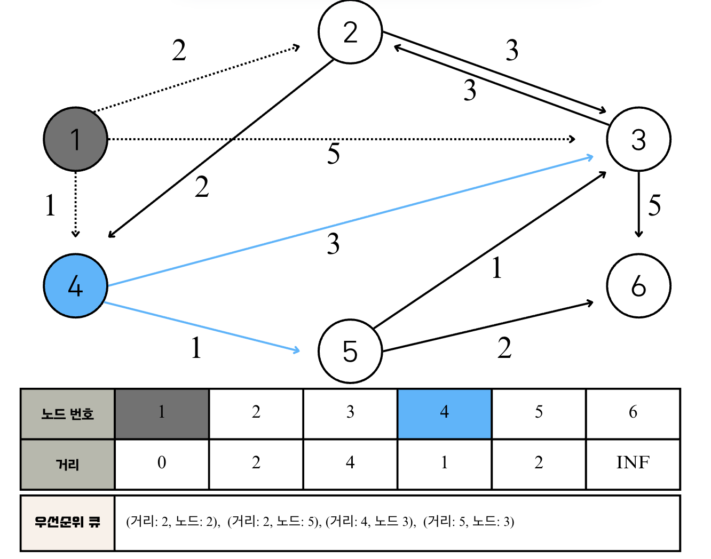

**Step 4**

우선순위 큐에서 원소를 pop하면 노드 2가 꺼내진다. 2번 노드를 거쳐서 가는 경우 중 다음 노드에서 현재의 최단 거리를 더 짧게 갱신할 수 있는 방법은 없다. 따라서 우선순위 큐에 어떠한 원소도 들어가지 않고 다음과 같이 리스트가 갱신된다. 

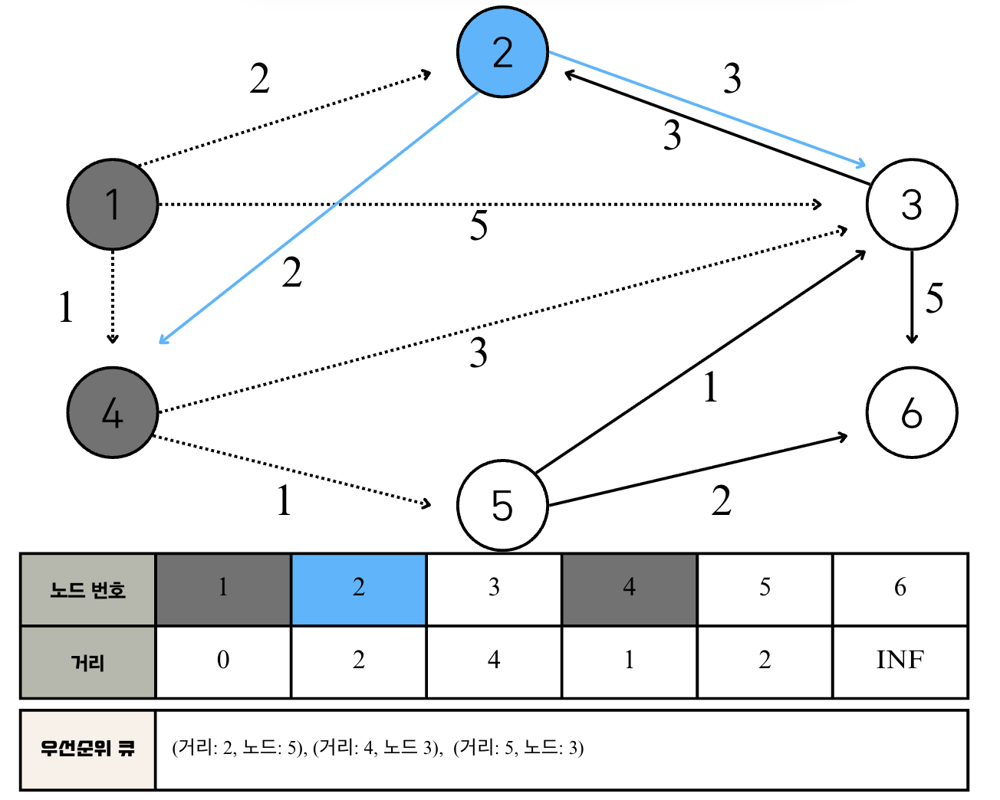

**Step 5**

이번 단계에서는 노드 5에 대해 처리한다. 5번 노드를 거쳐서 3번과 6번 노드로 갈 수 있다. 현재 5번 노드까지 가는 최단 거리가 2이므로 5번 노드에서 3번 노드로 가는 거리인 1을 더한 3이 기존의 값인 4보다 작다. 따라서 새로운 값인 3으로 갱신한다. 또한 6번 노드로 가는 최단 거리 역시 마찬가지로 갱신된다. 그래서 이번에는 (3, 3)과 (4, 6)이 우선순위 큐에 들어간다. 우선순위 큐를 보면, 작을 때마다 원소를 넣어주는데, 같은 노드이지만 이전에 넣어서 (거리) 값이 더 큰 원소가 있음을 확인할 수 있다. 따라서, heappop()으로 원소를 빼준 후, 가장 최신으로 업데이트된 값보다 큰 경우에는 무시하고 넘어가주면 된다. 

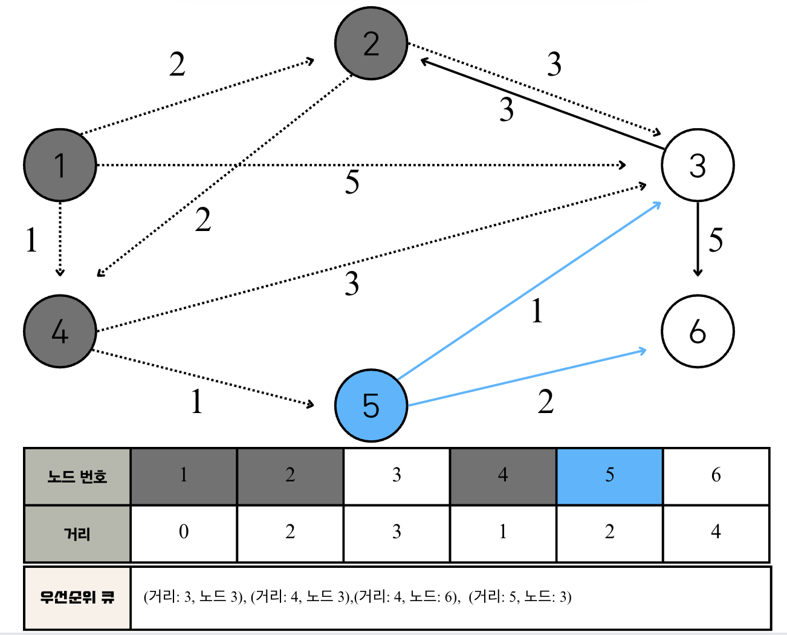

**Step 6**

우선순위 큐에서 노드 3을 빼고, 3에서는 노드 2번과 6번으로 갈 수 있다. 최단 거리 테이블은 갱신되지 않으며 따라서 우선순위 큐에도 아무것도 넣어주지 않는다. 

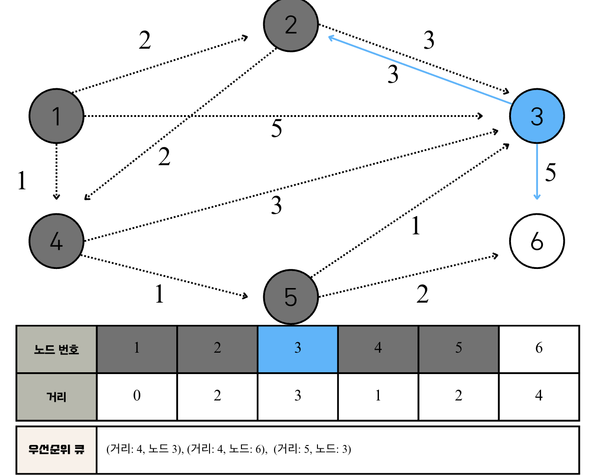

**Step 7**

원소 (4, 3)을 꺼낸다. 다만, 3번 노드는 현재 최단 거리 테이블의 값보다 크므로 이 원소는 무시한다. 


**Step 8**

이어서 원소 (4, 6)이 꺼내진다.


**Step 9**

마지막으로 남은 원소를 꺼내지만, 아까와 마찬가지로 이미 처리된 노드이므로 무시한다. 

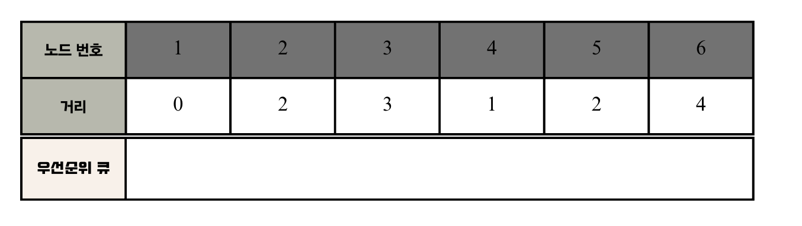

### 개선된 dijkstra 구현 

````{admonition} heapq를 이용한 dijkstra 구현 
:class: dropdown 

요약하면:

간단한 dijkstra 구현방식에서는 get_smallest_node()가 “아직 확정(visit)되지 않은 노드들 중” 최소 거리 노드를 골라야 하므로 visited가 필수이다. 방문(=최단거리 확정)한 노드를 다시 고르는 걸 막아야 하니까요. 다익스트라의 성질상, 음수 간선이 없을 때 최소 거리로 뽑힌 순간 그 노드는 최단거리 확정 → 곧바로 visited[now]=True.

그러나 힙/우선순위큐 버전의 dijkstra algorithm에서는 visited 없이도 동작한다. 이는 지연 삭제(lazy deletion) 패턴 때문인데, 힙에서 (거리, 노드)를 꺼낼 때 if cur_dis > distance[node]: continue로 오래된(더 긴) 후보를 무시합니다. 이 체크가 사실상 “이미 더 짧은 값으로 확정됨”을 검사하는 역할을 하므로, 별도의 visited가 없어도 됩니다. 

둘 다 같은 원리(비음수 가중치에서 “처음 확정되는 경로가 최단”)를 쓰는데, 배열 버전은 명시적 visited 집합을 둬서 재선택을 막고, 힙 버전은 힙에 중복 후보를 허용하되, 거리 비교로 무시해서 visited가 필요 없습니다.

```{code-block} python
import heapq 
import sys 
input = sys.stdin.readline 
INF = int(1e9)

# 노드의 개수, 간선의 개수를 입력받기 
n, m = map(int, input().split())
# 시작 노드 번호 입력 받기 
start = int(input())
 
# 각 노드에 연결되어 있는 노드에 대한 정보를 담는 리스트 만들기 
graph = [[] for i in range(n+1)]
# 최단 거리 테이블을 모두 무한으로 초기화 
distance = [INF] * (n+1)

# 모든 간선 정보 입력받기 
for _ in range(m):
    a, b, c= map(int, input().split())
    # a번 노드에서 b번 노드로 가는 비용이 c 
    graph[a].append((b, c))

def dijkstra(start):
    q = [] 

    distance[start] = 0
    heapq.heappush(q, (0, start))

    while q:
        cur_dis, node = heapq.heappop(q)

        if cur_dis > distance[node]:
            continue 

        for nxt_node, weight in graph[node]:
            if cur_dis + weight < distance[nxt_node]:
                distance[nxt_node] = cur_dis + weight # 현재 node까지 온 비용 + nxt_node로 가는 비용 
                heapq.heappush(q, (distance[nxt_node], nxt_node))

# 다익스트라 알고리즘 수행 
dijkstra(start)

# 모든 노드로 가기 위한 최단 거리 출력 
for i in range(1, n+1):
    if distance[i] == INF:
        print("INF")
    else:
        print(distance[i])

```
````

````{admonition} Dijkstra Algorithm Time Complexity 
:class: attention

1. heappop()
정점의 개수가 V개 이므로, 힙에서 의미있는 heapq.heappop() 연산 횟수는 V번이고, 각 pop연산의 시간 복잡도는 O(logV) 이므로, 

pop 전체 비용은 ~ Vlog(V) 이다. 

2. heappush()
현재의 정점 u에서 나가는 간선 (edge)를 볼때마다 새거리 (new distance)를 계산하고 갱신한다. 즉, 간선마다 최대 한 번씩 push가 발생하며, 간선 수 E개이고, push의 한 번 비용은 O(logV)이므로 push 전체 비용이 E*log(V)이다. 

3. 총 시간 복잡도 
총 O((V+E)logV)인데, 보통 그래프는 E >= V-1 이라서, O(ElogV)라고 언급된다. 
````

## Floyd-Warshall Algorithm

플로이드 워셜 알고리즘은 "모든 지점에서 다른 모든 지점까지의 최단 경로를 모두 구해야 하는 경우"에 사용할 수 있는 알고리즘이다. 다익스트라 알고리즘은 단계마다 최단 거리를 가지는 노드를 하나씩 반복적으로 선택한다. 그리고 해당 노드를 거쳐 가는 경로를 확인하며, 최단 거리 테이블을 갱신하는 방식으로 동작한다. 플로이드 워셜 알고리즘 또한 단계마다 '거쳐 가는 노드'를 기준으로 알고리즘을 수행한다. 하지만 **매번 방문하지 않은 노드 중에서 최단 거리를 갖는 노드를 찾을 필요가 없다**는 점이 다르다. 

노드의 개수가 N개 일 때 알고리즘상 N번의 단계를 수행하며, 단계마다 O($N^2$)의 연산을 통해 '현재 노드를 거쳐 가는' 모든 경로를 고려한다. 따라서 총 ***시간 복잡도는 O($N^3$)***이다. 

플로이드 워셜 알고리즘은 **2차원 리스트**에 '최단 거리'정보를 저장한다. 다익스트라 알고리즘은 그리디 알고리즘인 반면, 플로이드 워셜 알고리즘은 **다이나믹 프로그래밍**이다. 노드의 개수가 N개 일 때, N번 만큼의 단계를 반복하며 '점화식에 맞게' 2차원 리스트를 갱신하기 때문이다. 

## 플로이드 워셜 알고리즘 핵심 아이디어 

At each step, we take into account ***the case of going through that node***. 

예를 들어, 
1. 1번 노드 확인할 때는 A -> 1번 노드 -> B로 가는 비용 vs. 현재 최단 거리 테이블 A -> B 비용 비교 
2. 작은 값으로 최단 거리를 갱신한다. 

````{admonition} Floyd Warshall Algorithm 
:class: important 
**Algorithm Steps (Dynamic Programming)**
- Step 1: 즉, 알고리즘에서는 현재 확인하고 있는 노드를 제외한 N-1개의 노드 중에서 서로 다른 노드 (A, B) 쌍을 선택한다. 
- Step 2: 이후에 A -> 현재 노드 -> B로 가는 비용과 현재 최단 거리 테이블 A -> B 비용을 확인하여 최단 거리 갱신 

**Time complexity**: 
$_{N-1}P_{2}$ 쌍을 단계마다 반복해서 확인 -> 이를 O($N^2$)라고 생각하면 총 time complexity는 O($N^3$)

**점화식**: 
$D_{ab} = \min(D_{ab}, D_{ak}+D_{kb})$

'A에서 B로 가는 최소 비용'과 'A에서 K를 거쳐 B로 가는 비용'을 비교하여 더 작은 값으로 갱신한다. 즉, '바로 이동하는 거리'가 '특정한 노드를 거쳐서 이동하는 거리'보다 더 많은 비용을 가진다면 이를 더 짧은 것으로 갱신한다. 

구현:
- 3중 반복문을 이용하여 위의 점화식에 따라 최단 거리 테이블을 갱신 
````

아래의 예시를 공부해보자. 

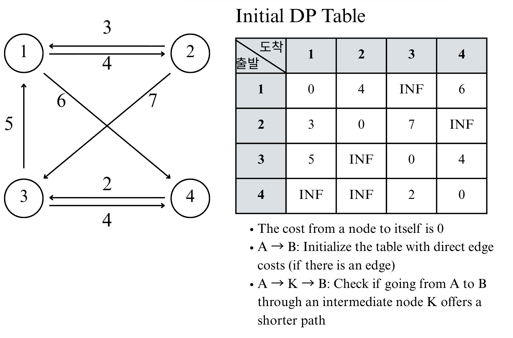


````{admonition} code for Floyd Warshall Algorithm
:class: dropdown 

위 예시에 해당하는 알고리즘을 파이썬으로 작성하였다. 

```{code-block} python


# N = the number of nodes, M = the number of edges 
N, M = map(int, input().split())
INF = int(1e9)
dp = [[INF] * (N+1) for _ in range(N+1)]

# print(dp)

# diagonal of dp table 
for i in range(1, N+1):
    dp[i][i] = 0

# initialize the dp with edges
for edge in range(M):
    # from a to b with c cost 
    a, b, c = map(int, input().split())
    dp[a][b] = c 

# iterate through nodes for an intermidiate node 
for intermidiate in range(1, N+1):
    # update dp 
    for a in range(1, N+1):
        for b in range(1, N+1):
            '''
            if a == k, a->a->b이면, a->a = 0이므로 동일해서 
            if a != k라는 조건이 있을 필요가 없음.
            '''
            dp[a][b] = min(dp[a][b], dp[a][intermidiate] + dp[intermidiate][b])


# print out the dp without node 0
for i in range(1, N+1):
    print(dp[i][1:])
```
````

## 예시 문제 

### 플로이드
[플로이드](https://www.acmicpc.net/problem/11404)

````{admonition} solution
:class: dropdown 

```{code-block} python
import sys
# sys.stdin = open('Input.txt', 'r')  # 로컬 테스트용

n = int(input())
m = int(input())
INF = 10**9
dp = [[INF] * (n + 1) for _ in range(n + 1)]

# 자기 자신으로의 비용 0
for i in range(1, n + 1):
    dp[i][i] = 0

# 간선 입력: 중복 간선 최소값 유지
for _ in range(m):
    a, b, c = map(int, input().split())
    dp[a][b] = min(dp[a][b], c)

def floyd():
    for k in range(1, n + 1):
        for a in range(1, n + 1):
            for b in range(1, n + 1):
                dp[a][b] = min(dp[a][b], dp[a][k] + dp[k][b])

floyd()

# 출력
for i in range(1, n + 1):
    for j in range(1, n + 1):
        print(0 if dp[i][j] == INF else dp[i][j], end=' ')
    print()
```
````
### Find a Safe Walk Through a Grid 
[Leetcode 3286](https://leetcode.com/problems/find-a-safe-walk-through-a-grid/description/?envType=problem-list-v2&envId=shortest-path)

````{admonition} class 사용하기 
:class: dropdown 

- class: 관련있는 **데이터(상태)** 와 **동작(메서드)** 을 한 덩어리로 묶는 설계도 
- instance(객체): 그 설계도로 찍어낸 실체. sol = Solution()처럼 생성 
- 언제 클래스를 쓰면 좋은가? 
    - 함수가 여러 개로 나뉘고 **공유해야 할 상태(예: 방문표시, DP 테이블)** 가 있을 때
    - 여러 전략/알고리즘(BFS/다익스트라/0-1 BFS)을 같은 인터페이스로 바꿔 끼우고 싶을 때
    - 로직이 커져 캡슐화/가독성이 필요할 때
- 언제 굳이 안 써도 되는가? 
    - 한두 개의 순수 함수로 끝나고 공유 상태가 거의 없을 때
    - “입력 → 출력”만 깔끔하게 끝나는 작은 유틸일 때
- 이 문제에서 클래스를 쓰는 이유 (장점)
    - 상태 보관: m, n, dp, health 같은 값을 전역 없이 self에 담아 메서드 간 공유.
    - 응집도↑: “그리드에서 안전 경로 찾기”라는 문제 도메인 로직이 한 곳에 모임.
    - 재사용/테스트 용이: 다른 테스트 케이스를 돌릴 때 인스턴스를 새로 만들거나, 메서드만 교체/확장하기 쉬움.
    - 확장성: 이후 “대각선 이동 허용”, “함정 칸 추가” 같은 규칙을 필드/메서드로 자연스럽게 추가.

- 해당 문제에서 설계 포인트
    - 상태: self.m, self.n, self.dp, self.health 
    - 불면식 (생각하기)
        - self.dp[y][x]: (y, x)에 도달했을때의 최대 남은 체력 
        - 항상 self.dp는 "지금까지 알려진 최선"을 저장 (다익스트라의 거리 배열 역할)
    - 메서드 분리 
        - findSafeWlk: 세팅 + "정답 반환"
        - dijkstra: 핵심 탐색 
        - in_range: 경계 체크
````

```{toggle}
grid가 아래처럼 start cell도 unsafe할 수 있는 경우를 생각하자. 
[[1, 1, 1, 1]]
```

````{admonition} class 정리 
:class: important
- “클래스는 상태와 동작을 함께 담아, 그래프 탐색 같은 문제에서 전역 없이 로직을 조직화한다.”
- “공유 상태가 있거나 전략을 바꿔 끼우고 싶을 때 특히 유리하다.”
- “짧고 순수한 변환 로직에는 함수형이 더 간단할 수 있다.”
````
````{admonition} solution
:class: dropdown 

```{code-block} python 
from heapq import heappush, heappop 
from typing import List

class Solution:
    def __init__(self):
        
        self.dp = []
        self.m=0
        self.n= 0
        self.health = 0
        

    def findSafeWalk(self, grid: List[List[int]], health: int) -> bool:
        MIN = -1
        start = (0, 0)
        self.m = len(grid)
        self.n = len(grid[0])
        self.dp = [[MIN]* self.n for _ in range(self.m)]
        self.health = health
        '''
        state = each index 
        what to store = the remaining health 
        transition = 
            if the current dp - (0/1 graph value) > 0:
                neigbhor = min(dp of neighbor, current dp - (0/1 graph value)])
        '''

        self.dijkstra(start, grid)
        '''
        Return true if you can reach the final cell with a health value of 1 or more, and false otherwise.
        '''
        return self.dp[self.m-1][self.n-1] >= 1

    def in_range(self, y, x):
        return 0<=y < self.m and 0<=x < self.n 

    def dijkstra(self, start, grid):

        DY = [-1, 1, 0, 0]; DX = [0, 0, -1, 1]
        cur_health = self.health - grid[0][0]
        self.dp[start[0]][start[1]] = cur_health
        q = []

        # (max health, y, x): the first item should be the value which the heap is prioritied by 
        q.append((-cur_health, 0, 0))

        while q:
            dis, y, x = heappop(q)
            dis = -dis

            if dis < self.dp[y][x]: # check visit 
                continue 

            for t in range(4):
                ny = y + DY[t]; nx = x + DX[t]
                if not self.in_range(ny, nx):
                    continue 
                
                # 다음 칸으로 "들어갈 때" 그 칸의 비용 지불
                # Cells (i, j) with grid[i][j] = 1 are considered unsafe and reduce your health by 1.
                if self.dp[y][x] - grid[ny][nx] > 0:
                    if self.dp[ny][nx] < self.dp[y][x] - grid[ny][nx]:
                        self.dp[ny][nx] = self.dp[y][x] - grid[ny][nx]
                        heappush(q, (-self.dp[ny][nx], ny, nx))


if __name__ == "__main__":
    sol = Solution()
    # grid = [[1,1,1],[1,0,1],[1,1,1]]
    # health = 5
    grid = [[1,1,1,1]]
    health = 4
    print(sol.findSafeWalk(grid, health))
    print(sol.dp)
```
````

### Digit Operations to Make Two Integers Equal 
[Leetcode 3377](https://leetcode.com/problems/digit-operations-to-make-two-integers-equal/description/?envType=problem-list-v2&envId=shortest-path)

````{admonition} solution
:class: dropdown 

```{code-block} python
import heapq

class Solution:
    def minOperations(self, n: int, m: int) -> int:
        # 자릿수 범위에 맞춰 소수 테이블 만들기 (예: n=abcd → 0..9999)
        limit = 10 ** len(str(n))
        is_prime = self._sieve(limit)

        # 시작/도착이 소수면 불가능
        if is_prime[n] or is_prime[m]:
            return -1

        # 다익스트라: (누적비용, 현재값)
        pq = [(n, n)]         # 시작 값도 비용에 포함
        seen = {n}            # 재방문 방지

        while pq:
            cost, cur = heapq.heappop(pq)
            if cur == m:
                return cost

            s = list(str(cur))
            L = len(s)

            for i, ch in enumerate(s):
                # +1 시도 (9 불가)
                if ch < '9':
                    s[i] = str(int(ch) + 1)
                    nxt = int(''.join(s))
                    if not is_prime[nxt] and nxt not in seen:
                        seen.add(nxt)
                        heapq.heappush(pq, (cost + nxt, nxt))
                    s[i] = ch  # 롤백

                # -1 시도 (0 불가, 맨 앞자리는 1→0 금지)
                if ch > '0' and not (i == 0 and ch == '1'):
                    s[i] = str(int(ch) - 1)
                    nxt = int(''.join(s))
                    if not is_prime[nxt] and nxt not in seen:
                        seen.add(nxt)
                        heapq.heappush(pq, (cost + nxt, nxt))
                    s[i] = ch  # 롤백

        return -1

    def _sieve(self, n: int):
        is_prime = [False, False] + [True] * (n - 2)
        p = 2
        while p * p < n:
            if is_prime[p]:
                step = p
                start = p * p
                is_prime[start:n:step] = [False] * (((n - 1) - start) // step + 1)
            p += 1
        return is_prime
```
````

### Evaluate Divison 
[Leetcode 399](https://leetcode.com/problems/evaluate-division/?envType=problem-list-v2&envId=shortest-path)

### Path with Maximum Probability 
[Leetcode 1512](https://leetcode.com/problems/path-with-maximum-probability/description/?envType=problem-list-v2&envId=shortest-path)

````{admonition} solution
:class: dropdown 

```{code-block} python 
from heapq import heappush, heappop
from typing import List

class Solution:
    def maxProbability(
        self, n: int, edges: List[List[int]], succProb: List[float],
        start: int, end: int
    ) -> float:
        # 1) 그래프 인접리스트 구성
        g = [[] for _ in range(n)]
        for (u, v), p in zip(edges, succProb):
            g[u].append((v, p))
            g[v].append((u, p))

        # 2) dist[i] = start→i 까지의 최대 성공 확률
        dist = [0.0] * n
        dist[start] = 1.0 # 확률을 곱해야하므로 0.0이 아닌, 1.0로 저장 

        # 3) 최대 힙처럼 쓰기 위해 음수로 저장
        pq = [(-1.0, start)]  # (음수 확률, 노드)

        while pq:
            neg_p, u = heappop(pq)
            p = -neg_p

            # 우선순위큐에서 뽑힌 값이 이미 더 작은(낡은) 값이면 스킵
            if p < dist[u]:
                continue

            # 목적지에 도달하면 현재 p가 최대 확률
            if u == end:
                return p

            # 4) 이웃 갱신
            for v, w in g[u]:
                np = p * w
                if np > dist[v]:
                    dist[v] = np
                    heappush(pq, (-np, v))

        return 0.0
```
````
### Minimum Cost to Converst String I
[Leetcode 2976](https://leetcode.com/problems/minimum-cost-to-convert-string-i/description/?envType=problem-list-v2&envId=shortest-path)
