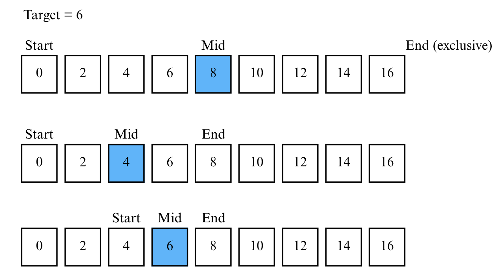

---
jupytext:
  formats: md:myst
  text_representation:
    extension: .md
    format_name: myst
    format_version: 0.13
    jupytext_version: 1.11.5
kernelspec:
  display_name: Python 3
  language: python
  name: python3
---

# Lecture 7-1. Binary Search 

## 순차 탐색 (Sequential Search)

***순차 탐색 (Sequential Search)*** 이란, 리스트 안에 있는 특정한 데이터를 찾기 위해 앞에서부터 데이터를 하나씩 차례대로 확인하는 방법이다. 보통 정렬되지 않은 리스트에서 데이터를 찾아야 할 때 사용한다. 리스트 내에 데이터가 아무리 많아도 시간만 충분하다면 항상 원하는 원소 (데이터)를 찾을 수 있다는 장점이 있다. 

````{admonition} source code for sequential search
:class: dropdown 

```{code-block} python
---
caption: 순차 탐색으로 Dongbin을 찾는 탐색 과정. 소스 코드를 실행하면 정상적으로 이름 문자열이 몇 번째 데이터인지 출력하는 것을 알 수 있다. 
---

def sequential_search(n, target, array):
    for i in range(n):
        if array[i] == target:
            return i + 1 # 현재의 위치 반환 (인덱스는 0부터 시작하므로 1 더하기)
        
print("생성할 원소 개수를 입력한 다음 한 칸 띄고 찾을 문자열을 입력하세요.")
input_data = input().split()
n = int(input_data[0])
target = input_data[1]

print("앞서 적은 원소 개수만큼 문자열을 입력세요. 구분은 띄어쓰기 한 칸으로 합니다.")
array = input().split()

print(sequential_search(n, target, array))
```
````
순차 탐색의 특징은 ***데이터의 정렬 여부와 상관없이*** 가장 앞에 있는 원소부터 하나씩 확인해야한다는 것이다. 데이터의 개수가 N개 일 때 최대 N번의 비교 연산이 필요하므로 순차 탐색은 최악의 경우 시간 복잡도 O(N)이다. 

## 이진 탐색 (Binary Search)

이진 탐색은 배열 내부의 ***데이터가 정렬되어 있어야만*** 사용할 수 있는 알고리즘이다. 이진 탐색은 탐색 범위를 절반씩 좁혀가며 데이터를 탐색하는 특징이 있다. 
이진 탐색은 위치를 나타내는 변수 3개를 사용하는데 탐색하고자 하는 범위의 ***시작점, 끝점, 그리고 중간점*** 이다. 찾으려는 데이터와 중간점 (Middle) 위치에 있는 데이터를 반복적으로 비교해서 원하는 데이터를 찾는다. 

"이미 정렬된" 9개의 데이터 중에서 값이 6인 원소를 찾는 예시를 살펴보자. 아래 그림에서 중요한 것은 end가 찾는 range에 inclusive한지 exclusive한지이다. 즉 아래의 예시는 [start: end)로 구현했을 때 결과를 보여준다. 



데이터의 개수는 9개이지만 총 3번의 탐색으로 원소를 찾을 수 있었다. 이진 탐색은 한 번 확인할때마다 확인하는 원소의 개수가 절반씩 줄어든다는 점에서 시간 복잡도가 O(logN)이다. 
코딩 테스트에서 이진 탐색 문제는 탐색 범위가 큰 상황에서의 탐색을 가정하는 문제가 많다. 따라서 탐색 범위가 2,000만을 넘어가면 이진 탐색으로 문제에 접근해보길 바란다. 

### 이진 탐색 구현 

1. 반복문으로 구현한 이진 탐색 

````{admonition} 반복문으로 구현한 이진 탐색 소스코드 [start:end)
:class: dropdown 

```{code-block} python
---
caption: binary search에서 [start:end) 범위인 경우 
---
data = [0, 2, 4, 6, 8, 10, 12, 14, 16]

def binary_search(arr, target):
    start = 0; end = len(arr)

    while start < end:
        mid = (start+end)//2 

        if arr[mid] == target:
            return mid # 존재하는 원소의 index 값을 반환 
        
        elif arr[mid] < target:
            start = mid + 1 
        else:
            end = mid 
    return -1 # 원소가 존재하지 않는 경우 

print(binary_search(data, 4))
```
````

````{admonition} 반복문으로 구현한 이진 탐색 소스코드 2 - [start:end]
:class: dropdown 

```{code-block} python
---
caption: binary search에서 [start:end] 범위인 경우 
---
data = [0, 2, 4, 6, 8, 10, 12, 14, 16]

def binary_search(arr, target):
    start = 0; end = len(arr) -1 # 다른 부분 1

    while start <= end: # 다른 부분 2
        mid = (start+end)//2 

        if arr[mid] == target:
            return mid 
        
        elif arr[mid] < target:
            start = mid + 1 
        else:
            end = mid -1 # 다른 부분 3
    return -1 # 원소가 존재하지 않는 경우 

print(binary_search(data, 4))

```
````

2. 재귀 함수로 구현한 이진 탐색 소스 코드 

````{admonition} 재귀 함수로 구현한 이진 탐색 소스 코드 [start:end)
:class: dropdown 

```{code-block} python
---
caption: binary search에서 [start:end) 범위인 경우 
---
data = [0, 2, 4, 6, 8, 10, 12, 14, 16]

def binary_search(arr, start, end, target):
    if start >= end:
        return -1 # 원소가 존재하지 않음 
    
    mid = (start + end) // 2 
    if arr[mid] == target:
        return mid 
    
    elif arr[mid] < target:
        return binary_search(arr, mid+1, end, target)
    else:
        return binary_search(arr, start, mid, target)
    

print(binary_search(data, 0, len(data), 4))
```
````

이진 탐색과 비슷한 구현을 할 수 있는 것이 `from bisect import bisect_left` 함수이다. 이 함수는 특정 target의 위치를 반환하는 것이 아니라, target이 리스트에 존재하지 않더라도 정렬 순서를 유지한 채 삽입될 수 있는 가장 왼쪽(작은) 인덱스 위치를 반환한다는 점에서 차이가 있다.

```python
from bisect import bisect_left

arr = [1, 3, 5, 7, 9]
print(bisect_left(arr, 5))  # 2 (정확히 존재)
print(bisect_left(arr, 6))  # 3 (6이 들어갈 "왼쪽" 위치)
```

````{admonition} Summary 
:class: important 

이진 탐색 
- 조건: 데이터가 정렬되어 있음 
- 구현: start, end, mid 3개의 pointer로 재귀합수 혹은 반복문으로 구현 
- 시간 복잡도: O(logN), 데이터가 많을 때 빠르게 찾아야할 경우 다른 알고리즘과 더불어 사용됨
````

## 트리 자료 구조 

이진 탐색은 전제 조건이 데이터 정렬이다. 
## 이진 탐색 트리 

## 예시 문제 