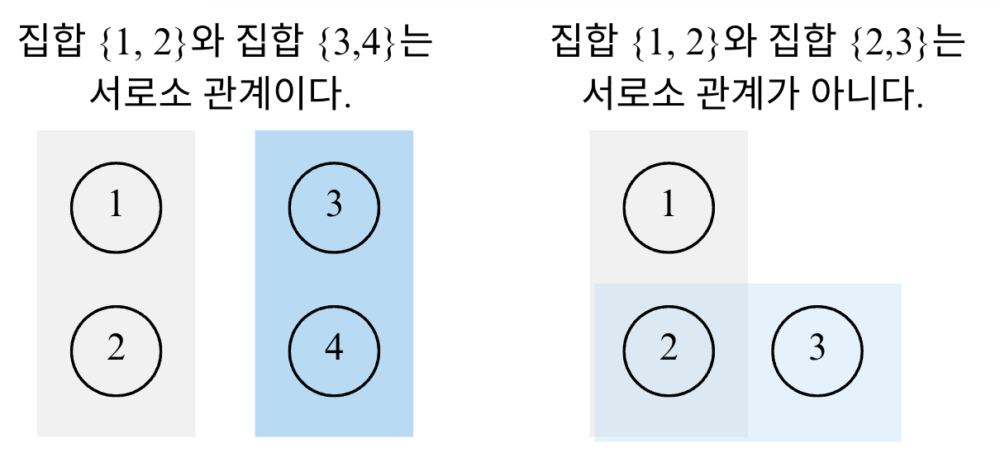

---
jupytext:
  formats: md:myst
  text_representation:
    extension: .md
    format_name: myst
    format_version: 0.13
    jupytext_version: 1.11.5
kernelspec:
  display_name: Python 3
  language: python
  name: python3
---

# Lecture 8-1. Graph Algorithm 

DFS/BFS와 최단 경로에서 다른 내용은 모두 그래프 알고리즘의 한 유형으로 볼 수 있다. 일단, 알고리즘 문제를 접했을 때 ***서로 다른 개체 (혹은 객체 Object )가 연결되어 있다*** 는 것을 보면 가장 먼저 그래프 알고리즘을 떠올려야 한다. 

## 서로소 집합 

수학에서 ***서로소 집합*** Disjoint Sets이란 공통 원소가 없는 두 집합을 의미한다. 

### 서로소 집합 자료구조 

서로소 집합 자료구조란 ***서로소 부분 집합들로 나누어진 원소들의 데이터를 처리하기 위한 자료구조*** 이다. "union"과 "find" 2개의 연산으로 조작할 수 있다. 서로소 집합에서 "find"연산은 특정한 원소가 속한 집합이 어떤 집합인지 알려주는 연산, "union"연산은 합집합으로 2개의 원소가 포함된 집합을 하나의 집합으로 합치는 연산이다. 

서로소 집합 자료구조는 ***union-find 자료구조*** 라고 불리기도 한다. 두 집합이 서로소 관계인지를 확인할 수 있다는 말은 각 집합이 어떤 원소를 공통으로 가지고 있는지를 확인할 수 있다는 말과 같기 때문이다. 

## 신장 트리 

## 위상 정렬 

