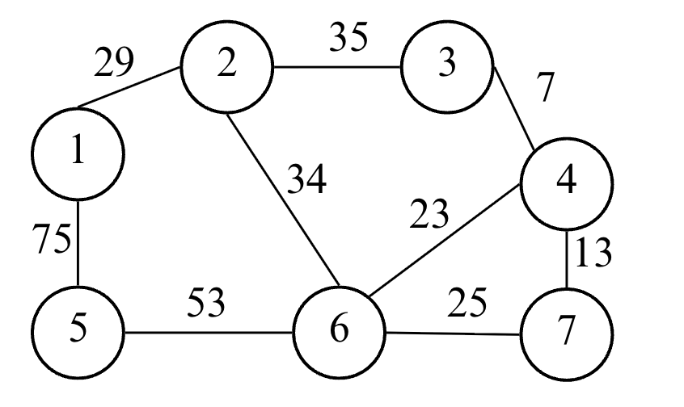
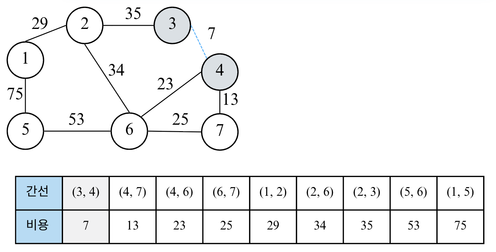
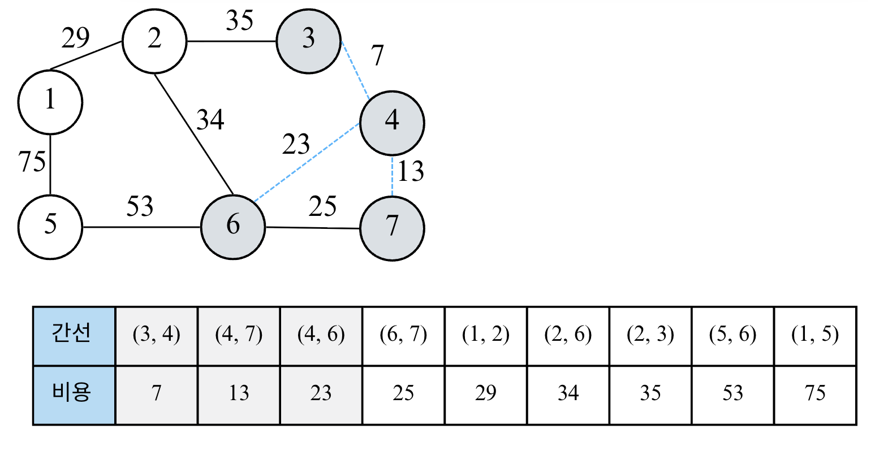
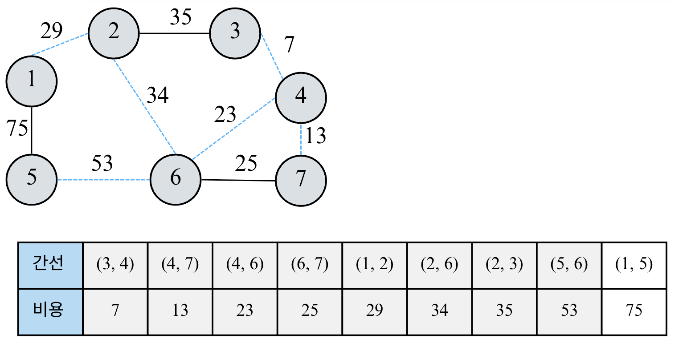
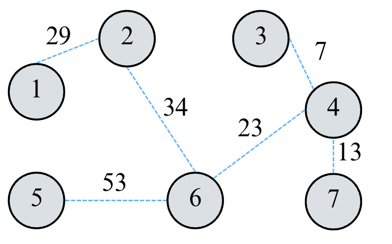

---
jupytext:
  formats: md:myst
  text_representation:
    extension: .md
    format_name: myst
    format_version: 0.13
    jupytext_version: 1.11.5
kernelspec:
  display_name: Python 3
  language: python
  name: python3
---

# Lecture 8-1. Graph Algorithm 

DFS/BFS와 최단 경로에서 다른 내용은 모두 그래프 알고리즘의 한 유형으로 볼 수 있다. 일단, 알고리즘 문제를 접했을 때 ***서로 다른 개체 (혹은 객체<font size='2'> Object </font>)가 연결되어 있다*** 는 것을 보면 가장 먼저 그래프 알고리즘을 떠올려야 한다. 

## 서로소 집합 (Disjoint Set)

수학에서 ***서로소 집합*** <font size='2'>Disjoint Sets</font>이란 공통 원소가 없는 두 집합을 의미한다. 


### 서로소 집합 자료구조 

서로소 집합 자료구조란 ***서로소 부분 집합들로 나누어진 원소들의 데이터를 처리하기 위한 자료구조*** 이다. "union"과 "find" 2개의 연산으로 조작할 수 있다. 서로소 집합에서 "find"연산은 특정한 원소가 속한 집합이 어떤 집합인지 알려주는 연산, "union"연산은 합집합으로 2개의 원소가 포함된 집합을 하나의 집합으로 합치는 연산이다. 

서로소 집합 자료구조는 ***union-find 자료구조*** 라고 불리기도 한다. 두 집합이 서로소 관계인지를 확인할 수 있다는 말은 각 집합이 어떤 원소를 공통으로 가지고 있는지를 확인할 수 있다는 말과 같기 때문이다. 

**핵심 개념 요약**

```{list-table} disjoint set / union-find
:widths: 15 50 
:header-rows: 1 

* - 항목 
  - 설명 
* - 정의 
  - 서로 겹치지 않는 부분 집합들로 구성된 집합을 관리하는 자료구조 
* - 핵심 연산 
  - find(x): 원소 `x`가 속한 집합 (루트 노드) 찾기 <br> , union(a, b): 두 원소가 속한 집합을 하나로 합치기 
* - 주요 목적
  - 두 원소가 "같은 집합(=같은 그룹)"에 속해 있는지 빠르게 판별하기 
* - 대표 활용
  - 그래프의 사이클 판별, 네트워크 연결 여부, MST (최소 신장 트리) (Kruskal 알고리즘)
```

**기본 아이디어** 
- 각 노드는 자기 자신을 부모로 가지는 트리 형태로 시작한다. 
- 집합을 병할할때는 **루트 노드(대표자)** 를 기준으로 합친다. 

```python
# 부모 노드 정보 저장 
parent = [i for i in range(n+1)]

# find 연산 (경로 압축)
def find(x):
  if parent[x] != x:
    parent[x] = find(parent[x])
  return parent[x]

# union 연산 (대표자 기준으로 합치기)
def union(a, b):
  rootA, rootB = find(a), find(b)
  if rootA != rootB:
    parent[rootB] = rootA 
```

### 경로 압축 (Path Compression)

find() 연산을 반복할수록 트리 깊이가 깊어지면 성능이 나빠진다. 
-> 경로 압축을 적용하면 ***모든 노드가 바로 루트를 가리키게 만들어*** 평균 시간복잡도 O($\alpha(N)$)*로 줄일 수 있다. 즉, find()시 트리를 납작하게 만드는 역할을 한다. 

* $\alpha$는 아커만 함수의 역함수로 사실상 상수 

예를 들어, union(a, b)로 두 집합이 합쳐진 후에, find함수로 root를 찾으면, parent가 모두 root으로 되어 후에 다시 parent를 찾고자 할때 빠른 시간안에 찾을 수 있다. 

```python
# without compression 
# def find(x):
#   return parent[x]

def find(x):
    if parent[x] != x:
        parent[x] = find(parent[x])  # 루트를 재귀적으로 찾으며 압축
    return parent[x]
```

### 랭크 기반 합치기 (Union by Rank / Size)

Union by Rank”는 항상 낮은 트리를 높은 트리에 붙여서, **트리의 높이(깊이)**를 일정하게 유지시키는 균형 유지 전략이다. 이로 인해 find()의 평균 시간이 **거의 O(1)**로 줄어든다

- 랭크 (rank): ***트리의 높이*** , 또는 ***노드 수(size)*** 를 나타내는 값. 
  - union by rank (height) -> 높이가 낮은 트리를 높은 트리에 붙임 
  - union by size (count) -> 노드 수가 적은 트리를 많은 쪽에 붙임 
- 목적: 트리의 불균형 방지 (=**높이의 최소화 및 breadth가 넓음** )
- 구현: 처음에 0 (height) 이나 1(size)로 초기화해준 후, "union"이 일어날 때만 갱신되며 트리의 대략적인 깊이 정보를 유지한다. 

**예시**
```python
union(1,2)
union(2,3)
union(3,4)
union(4,5)
```
랭크 기반 사용 안하는 경우 
1- 2-3-4-5 : 트리 높이 4 로 find(5)하면 4회 재귀, 시간복잡도 O(N)

랭크기반 사용하는 경우 
```{code-block} text
union(1,2) → rank[1]=1
union(3,4) → rank[3]=1
union(1,3) → rank[1]=2 (같은 높이였으므로 +1)
union(5,6) → rank[5]=1
union(1,5) → 5의 높이 낮으므로 5를 1 밑으로
```
결과 
    1
  / | \
2   3   5
    |   \
    4    6

트리 높이: 2, find(6) -> 2번만에 루트로 올라감. 시간 복잡도 거의 O(1) 
```python
rank = [1]*(n+1)

def union(a, b):
    rootA, rootB = find(a), find(b)
    if rootA == rootB:
        return
    if rank[rootA] < rank[rootB]:
        parent[rootA] = rootB
    elif rank[rootA] > rank[rootB]:
        parent[rootB] = rootA
    else:
        parent[rootB] = rootA
        rank[rootA] += 1
```

```{list-table} union/find 시간 복잡도 
:widths: 15 40 45
:header-rows: 1 

* - 연산 
  - 평균 시간복잡도 
  - 설명 
* - find()
  - O($\alpha (N)$)
  - 경로 압축 사용 시 거의 상수 
* - union()
  - O($\alpha (N)$)
  - find를 포함하므로 동일 
* - 전체 N개의 원소, M개의 연산 
  - O((N+M) $\alpha (N)$) ~ O(N+M)
  - 거의 선형 시간 
```


### 대표 활용 예시 

1. 사이클 판별 (Cycle Detection): 그래프 간선을 순서대로 확인하며 같은 집합에 속한 두 노드를 다시 연결하려 할 때 -> 사이클 존재 
```python
for a, b in edges:
  if find(a) == find(b):
    print("Cycle detected")
  else:
    union(a, b)
```
2. 최소 신장 트리 (Kruskal Algorithm)
```python
edges.sort(key=lambda x: x[2]) # (a, b, weight)
cost = 0

for a, b, w in edges:
  if find(a) != find(b):
    union(a, b)
    cost += w 
```

3. 연결 요소 세기 (Connected Components): find(i)를 전체 노드에 수행하여 루트가 몇 개인지 카운트하면 서로 연결된 컴포넌트 개수를 구할 수 있음 
  
```python
components = len(set(find(i)) for i in range(1, n+1))
```
   
#### Redundant Connection 
[Leetcode 684](https://leetcode.com/problems/redundant-connection/description/)

````{admonition} solution 
:class: dropdown 

```{code-block} python
class Solution:
    def findRedundantConnection(self, edges: List[List[int]]) -> List[int]:  
        def find(v):
            nonlocal parent 
            if parent[v] == v:
                return v 
            parent[v] = find(parent[v]) # parent compression 
            return parent[v]

        def union(a, b):
            nonlocal parent, rank
            rootA = find(a)
            rootB = find(b) 

            if rootA != rootB:
                if rank[rootA]== rank[rootB]:
                    rank[rootA] += 1 
                    parent[rootB] = rootA 
                elif rank[rootA] > rank[rootB]:
                    parent[rootB] = rootA 
                else:
                    parent[rootA] = rootB 
                return False 
            else:
                return True # has a cycle 
        
        n = len(edges)
        parent = [i for i in range(n+1)]
        rank = [1] * (n+1) # height 
        for edge in edges:
            flag = union(edge[0], edge[1])
            if flag: # if the graph has a cycle 
                return edge 
```
````

#### Number of Provinces 
[Leetcode 547](https://leetcode.com/problems/number-of-provinces/description/)

````{admonition} solution
:class: dropdown 

```{code-block} python
from typing import List 

class Solution:
    def findCircleNum(self, isConnected: List[List[int]]) -> int:

        def find(node):
            # nonlocal parent: mutable객체의 내용을 수정할때는 키워드 불필요, 재할당시에는 필요 
            if parent[node] == node:
                return node 
            parent[node] = find(parent[node])
            return parent[node]
        
        def union(a, b):
            # nonlocal parent, rank, Gcnt, total_Gcnt
            rootA = find(a); rootB = find(b)
            if rootA == rootB: # 두 개를 연결하면 cycle이 된다는 건 이미 같은 그룹이었다는 것이므로 total group cntㄹ를 뺄 필요가 없음 
                return 
            
            if rank[rootA] == rank[rootB]:
                parent[rootB] = rootA
                rank[rootA] += 1 
            elif rank[rootA] > rank[rootB]:
                parent[rootB] = rootA 
            else:
                parent[rootA] = rootB 

            
            # 전체 group 카운트 세기 
            total_Gcnt -= 1
        
        n = len(isConnected)
        if n == 1:
            return 1 
        
    
        total_Gcnt = n 
        parent = [i for i in range(n)]
        rank = [0] * n

        for cur_node in range(n):
            for nxt_node in range(cur_node+1, n): # undirected graph라서 matrix의 대각선 위쪽만 보고 계산 
                if isConnected[cur_node][nxt_node]:
                    union(cur_node, nxt_node)
        

        return total_Gcnt 

# isConnected = [[1,1,0],[1,1,0],[0,0,1]]
isConnected = [[1,0,0],[0,1,0],[0,0,1]]
sol = Solution()
print(sol.findCircleNum(isConnected))
```
````

#### Graph Valid Tree 
[Leetcode 261]
#### Lexicographically Smallest Equivalent String 
[Leetcode 1061]
#### Find if Path Exists in Graph 
[Leetcode 1971]

## 신장 트리 (Spanning Tree)

Spanning Tree란 ***하나의 그래프가 있을 때 모든 노드를 포함하면서 사이클이 존재하지 않는 "부분 그래프"*** 를 의미한다. 이때 위의 조건은 트리의 성립조건과 동일하기도 하다. 


위의 그림의 오른쪽은 왼쪽 그래프의 신장 트리를 찾을 수 있다. 하나의 그래프에서 여러 개의 신장 트리를 찾을 수 있다. 아래 그림을 보면, 신장 트리가 아닌 부분 그래프 예시를 볼 수 있다. 


***최소 신장 트리(Minimum Spanning Tree)*** 란, "하나의 그래프에서 모든 노드를 연결하면서, 그 중 **간선의 가중치 합이 최소가 되는** 신장 트리"를 의미한다. 

즉, 그래프의 모든 노드를 연결하되, 
- 사이클이 없어야하고 (Tree 조건),
- 전체 간선 가중치의 합이 최소가 되도록 해야 한다. 

대표적인 최소 신장 트리 알고리즘은 Kruskal과 Prim 알고리즘이 있다. 

### Kruskal's Algorithm 

크루스칼 알고리즘은 탐욕적 (Greedy) 접근법을 사용한다. 가중치가 가장 작은 간선부터 차례대로 선택하면서 ***사이클이 생기지 않도록*** 트리를 만들어나간다. 즉 핵심 아이디어는 <br>

```text
"항상 가장 비용이 작은 간선을 선택하되, 이미 연결된 노드끼리는 연결하지 않는다." 
```

```{admonition} Kruskal's Algorithm 
:class: note 

**알고리즘 과정** 
1. 모든 간선을 가중치 기준으로 오름차순 정렬 
2. 가장 작은 간선부터 차례대로 확인 
    - 두 노드가 서로 다른 집합 (즉, 연결되어있지 않음)이면 Union
    - 이미 같은 집합이면 Cycle이 생기므로 Skip 
3. 모든 노드가 연결될 때까지 반복 
4. 최종적으로 선택된 간선들의 가중치 합이 MST의 비용 
```

위의 알고리즘에서 cycle 판별을 구현할때, 앞서 배운 서로소 집합 (disjoint set) 구조를 이용한다. 즉, 이전에 배운 Union-Find 알고리즘을 사용하여 cycle을 판별하면 된다. 

**예시** <br>



위의 그래프에서 MST를 구해보자. 먼저 MST는 트리 자료 구조인데, 트리 자료 구조는 노드의 개수가 N개일 때, 항상 간선의 개수가 N-1개임을 알아야한다. 

**Step 1**<br>


간선 정보들을 모은 리스트를 간선 비용에 대하여 오름차순으로 정리한다. 

**Step 2**<br>


가장 짧은 간선을 처리한다. (3, 4)가 선택되고 이것을 집합에 포함하면 된다. 다시 말해 노드 3과 노드 4에 대해서 union함수를 실행하여 동일한 집합에 속하도록 만든다. 

**Step 3**<br>


그 다음 가장 짧은 간선을 처리한다. (4, 7)가 선택되고 이것을 집합에 포함하면 된다. 노드 4과 노드 7는 같은 집합에 속해있는지 확인하고 같은 집합에 속해있지 않기 때문에, union함수를 호출한다. 

**Step 4**<br>


그 다음 가장 짧은 간선을 처리한다. (4, 6)가 선택한다. 노드 4과 노드 6는 같은 집합에 속해있는지 확인하고 같은 집합에 속해있지 않기 때문에, union함수를 호출한다. 

**Step 4**<br>


그 다음 가장 짧은 간선을 처리한다. (6, 7)가 선택한다. 노드 6과 노드 7는 이미 같은 집합에 속해있으므로 union함수를 호출하지 않아 신장 트리에 포함하지 않는다. 그림에서 처리된 간선만 파란색 점선으로 표시된다. 

**Step 5**<br>


그 다음 가장 짧은 간선을 처리한다. (1, 2)가 선택한다. 노드 1과 노드 2는 같은 집합에 속해있는지 확인하고 같은 집합에 속해있지 않기 때문에, union함수를 호출한다. 

**Step 6**<br>


그 다음 가장 짧은 간선을 처리한다. (2, 6)가 선택한다. 노드 2과 노드 6는 같은 집합에 속해있는지 확인하고 같은 집합에 속해있지 않기 때문에, union함수를 호출한다. 

**Step 7**<br>


그 다음 가장 짧은 간선을 처리한다. (2, 3)가 선택한다.  노드 2과 노드 3는 이미 같은 집합에 속해있으므로 union함수를 호출하지 않아 신장 트리에 포함하지 않는다. 

**Step 8**<br>


그 다음 가장 짧은 간선을 처리한다. (5, 6)가 선택한다.  노드 5과 노드 6는 같은 집합에 속해있는지 확인하고 같은 집합에 속해있지 않기 때문에, union함수를 호출한다. 

**Step 9**<br>


그 다음 가장 짧은 간선을 처리한다. (1, 5)가 선택한다.  노드 1과 노드 5는 이미 같은 집합에 속해있으므로 union함수를 호출하지 않아 신장 트리에 포함하지 않는다. 

결과적으로 아래와 같은 MST를 찾을 수 있으며, 최소 신장 트리에 포함되어 있는 간선의 비용만 모두 더하면 그 값이 최종 비용에 해당한다. 



### Code and Time Complexity 

다음은 Kruskal's Algorithm의 소스 코드 및 시간 복잡도이다. 아래 코드를 보면 list.sort()방식을 사용하는데, min-heap을 써도 되는지 궁금할 수 있다. 보통 list의 sort를 사용하고, min-heap이 유리한 경우에는 간선이 스트리밍으로 들어오거나 한 번에 다 만들기 어려운 상황(외부 입력/온라인 처리)이나  “가장 싼 간선부터 일부만” 처리하며 중간에 조기 종료가 확실한 특수 케이스 때 사용한다. 그 외 일반 코테/LeetCode 환경에선 그냥 정렬이 간단하고 빠른 편이다.

````{admonition} code of Kruskal's Algorithm 
:class: dropdown 

```{code-block} python 
# Kruskal's Algorithm (Union-Find 이용)
from typing import List, Tuple

def find(parent, x):
    if parent[x] != x:
        parent[x] = find(parent, parent[x])
    return parent[x]

def union(parent, rank, a, b):
    rootA, rootB = find(parent, a), find(parent, b)
    if rootA == rootB:
        return False
    if rank[rootA] < rank[rootB]:
        parent[rootA] = rootB
    elif rank[rootA] > rank[rootB]:
        parent[rootB] = rootA
    else:
        parent[rootB] = rootA
        rank[rootA] += 1
    return True

def kruskal(n: int, edges: List[Tuple[int, int, int]]) -> int:
    # edges: (비용, 노드1, 노드2)
    edges.sort(key=lambda x: x[0])  # 1️⃣ 간선 정렬
    parent = [i for i in range(n)]
    rank = [0] * n
    total_cost = 0

    for cost, a, b in edges:         # 2️⃣ 간선 하나씩 확인
        if union(parent, rank, a, b): # 3️⃣ 사이클 없으면 포함
            total_cost += cost

    return total_cost
```
````

```{list-table} Kruskal's Algorithm 시간 복잡도 
:widths: 20 45 
:header-rows: 1

* - 단계 
  - 복잡도 
* - 간선 정렬 
  - O(E logE)
* - Union-Find 연산 
  - O (E $\alpha$(V)) ~ O(E)
* - 총합 
  - O(E logE)
```

````{admonition} Summary for MST 
:class: important 

- MST (Minimum Spanning Tree): 간선 비용의 합이 최소가 되는 Spanning Tree (cycle이 없으며, 모든 노드를 포함하는 트리)
- 크루스칼 알고리즘: "간선을 정렬하고, Cycle이 생기지 않게 하나씩 추가하는 Greedy 방식의 MST 알고리즘이다. 
  - 트리 자료 구조는 노드의 개수가 N개일 때, 항상 간선의 개수가 N-1개이다. 
  - 시간 복잡도는 O(E logE)이며, 서로소 집합 구조를 활용하여 union-find 함수로 구현한다. 
````
### MST 예시 문제 

#### Min Cost to Connect All Points 

[Leetcode 1584](https://leetcode.com/problems/min-cost-to-connect-all-points/description/?envType=problem-list-v2&envId=minimum-spanning-tree)

````{admonition} solution
:class: dropdown 

```{code-block} python
from typing import List 

class Node:
    def __init__(self, y, x, num):
        self.y = y 
        self.x = x
        self.num = num

    def __repr__(self):
        return f"Node {self.num}"

class Solution:
    def minCostConnectPoints(self, points: List[List[int]]) -> int:
        n = len(points)
        nodes = []

        for idx in range(n):
            cur_node = Node(points[idx][0], points[idx][1], idx)
            nodes.append(cur_node)

        edges = []
        for idx in range(n):
            for j in range(idx+1, n):
                cost = abs(nodes[idx].y-nodes[j].y) + abs(nodes[idx].x - nodes[j].x)
                edges.append((cost, nodes[idx].num, nodes[j].num))

        # sort the edges 
        edges.sort(key=lambda x : x[0])
        parent = [i for i in range(n)]
        rank = [0]*n 
        total_cost = 0

        for cost, a, b in edges:
            if union(parent, rank, a, b):
                total_cost += cost 

        return total_cost
    
def find(parent, node):
    if parent[node] == node:
        return node 
    
    parent[node] = find(parent, parent[node]) # compression 
    return parent[node]

def union(parent, rank, a, b):
    rootA = find(parent, a); rootB = find(parent, b)
    if rootA == rootB:
        return False # cycle 존재 

    if rank[rootA] == rank[rootB]:
        rank[rootA] += 1 
        parent[rootB] = rootA 
    elif rank[rootA] > rank[rootB]:
        parent[rootB] = rootA 
    else:
        parent[rootA] = rootB

    return True 


if __name__ == "__main__":
    # points = [[0,0],[2,2],[3,10],[5,2],[7,0]] # 20 
    points = [[3,12],[-2,5],[-4,1]] # 20 
    sol = Solution()
    print(sol.minCostConnectPoints(points))
```
````

#### Find Critical and Pseudo-Critical Edges in MST 

[Leetcode 1489](https://leetcode.com/problems/find-critical-and-pseudo-critical-edges-in-minimum-spanning-tree/description/?envType=problem-list-v2&envId=minimum-spanning-tree)

## 위상 정렬 (Topological Sort)

위상 정렬 (Topological Sort)은 정렬 알고리즘의 일종으로 ***방향 그래프(Directed Graph)의 모든 노드를 '방향성(간선의 방향)에 거스르지 않도록 순서대로 나열'하는 것*** 이다. 즉, 한 노드가 다른 노드보다 먼저 처리되어야하는 순서가 있을 때, 그 순서를 유지하면서 모든 노드를 정렬하는 알고리즘이다. 

예를 들어, 대학 교과목에서 선수 과목이 있을 때, 차례대로 들어야하는 과목들의 나열하는 예시가 있다. 대학 교과목에서 "A -> B -> C"처럼 B를 듣기 전에 반드시 A를 들어야 하는 경우를 생각해보자. 

- A -> B: A를 먼저 수강해야 B를 수강할 수 있음 
- B -> C: B를 먼저 수강해야 C를 수강할 수 있음 
- 가능한 위상 정렬 결과: A -> B -> C 

따라서, 위상 정렬의 핵심조건은 다음과 같다. 

```{admonition} 위상 정렬 조건 및 아이디어 
:class: note 

**조건** <br>
1. 방향 그래프 (Directed Graph)여야 함
2. 사이클이 없어야함 (DAG: Directed Acyclic Graph) -> 만약 사이클이 있다면, 순서를 정할 수 없다. 

**아이디어** <br>
- "진입 차수(indegree)"가 0인 노드부터 차례대로 제거한다. 
  - 진입 차수란, 특정 노드로 들어오는 간선의 개수
  - 즉, "먼저 처리되어야 하는 선행 노드의 개수"를 의미한다. 
```

**알고리즘 순서 (Kahn's Algorithm)** 

1. 그래프의 모든 노드에 대해 진입 차수를 계산한다. 
2. 진입 차수가 0인 노드를 큐(Queue)에 넣는다.  -> 선행 조건이 없는 노드부터 시작 
3. 큐에서 노드를 꺼내며 결과 리스트에 추가한다. -> 그리고 그 노드와 연결된 노드의 진입 차수를 -1 낮춘다. (그 노드와 연결된 간선을 제거한다)
4. 새롭게 진입 차수가 0이 된 노드를 큐에 넣는다. 
5. 큐가 빌때까지 3~4를 반복한다. 
-> 큐가 비었는데, 아직 방문하지 않은 노드가 남아있다 → ***사이클 존재***
-> 사이클 속에 있는 노드들은 서로 연결되어 있기 때문에 그 중 어느 노드도 진입차수(indegree)가 0이 될 수 없음.

**예시**


위의 그래프에 대하여 위상 정렬을 해보자. 

**Step 1** <br>


간선을 돌면서, 진입 차수들을 계산하고 진입 차수가 0인 노드를 queue에 집어넣는다. 

**Step 2** <br>


1을 큐에서 꺼내고 결과에 추가한다 (result=[1]). 노드 1과 연결된 2, 3 노드의 진입 차수를 각각 1씩 감소한다. 노드 2와 노드 3의 진입 차수가 0이 되었으므로 큐에 추가한다. 

**Step 3** <br>


2를 큐에서 꺼내고 결과에 추가한다. (result=[1, 2]). 노드 2와 연결된 노드 4의 진입 차수를 1씩 감소한다. 진입 차수가 0이 된 노드가 없으니 다음 스텝을 진행한다. 

**Step 4** <br>


3을 큐에서 꺼내고 결과에 추가한다. (result=[1, 2, 3]). 노드 3과 연결된 노드 4의 진입 차수를 1씩 감소한다. 진입 차수가 0이된 노드 4를 큐에 추가한다. 

**Step 5** <br>


4를 큐에서 꺼내고 결과에 추가한다. (result=[1, 2, 3, 4]). 노드 4와 연결된 노드가 없으니 건너뛴다. 큐가 비었으므로 result를 반환한다. 


### 위상 정렬 알고리즘 및 시간 복잡도 

````{admonition} source code for topological sort 
:class: dropdown 

```{code-block} python
from collections import deque

def topology_sort(V, edges):
    indegree = [0] * (V + 1)
    graph = [[] for _ in range(V + 1)]

    # 1️⃣ 그래프 구성 및 진입차수 계산
    for a, b in edges:
        graph[a].append(b)
        indegree[b] += 1

    # 2️⃣ 진입차수 0인 노드 큐에 삽입
    q = deque([i for i in range(1, V + 1) if indegree[i] == 0])
    result = []

    # 3️⃣ 큐가 빌 때까지 반복
    while q:
        cur = q.popleft()
        result.append(cur)

        # 4️⃣ 연결된 노드들의 진입차수 감소
        for nxt in graph[cur]:
            indegree[nxt] -= 1
            if indegree[nxt] == 0:
                q.append(nxt)

    return result

```
````

시간 복잡도: O(V+E) -> 모든 노드와 간선을 한번씩만 탐색 

위의 코드에서 이중 loop으로 착각할 수 있지만, 모든 정점은 popleft()에서 한번, 그리고 각 간선도 존재할때만 1번씩 방문하여 O(V) + O(E) 이다. 즉, for nxt in graph[cur] 는 정점마다 무조건 반복되는 것이 아니라 각 간선이 존재할 때만 수행됨. 즉, 모든 간선과 모든 정점을 방문하는 것이 항상 같이 일어나는 것은 아니다. 

```python
while q:                     # 각 정점은 최대 한 번만 큐에서 pop
    cur = q.popleft()
    for nxt in graph[cur]:   # cur에서 나가는 간선들만 순회 (총합 = E)
        indegree[nxt] -= 1
        if indegree[nxt] == 0:
            q.append(nxt)
```

정리하자면, 위상 정렬은 사이클이 없는 ***방향 그래프 (DAG)*** 에서, 간선의 방향을 거스르지 않게 노드를 나열하는 정렬 알고리즘 이다. 주요 개념으로 진입 차수, 큐가 있고, BFS기반인 Kahn's Algorithm을 통해 구현한다. 시간 복잡도는 O(V +E)이다. 만약 진행 과정 중 진입 차수가 0인 노드가 더 이상 없을 때 남은 노드가 존재한다면 사이클이 존재함을 검출할 수 있다. 

위상 정렬은 다음 상황에서 사용할 수 있다. 

1. 과목 선수 조건: A과목을 듣기 전에 B과목을 들어야함. 
2. 작업 스케줄링: 어떤 작업은 다른 작업이 끝나야 시작 가능 
3. 컴파일 순서 결정: 어떤 모듈이 다른 모듈보다 먼저 컴파일이 되어야 함 
4. 빌드 시스템 (예: Makefile): 파일 간 의존성 분석 및 빌드 순서 결정 
   
```{admonition} summary
:class: dropdown 

- 위상 정렬은 사이클이 없는 방향 그래프 (DAG)에서, 간선의 방향을 거스르지 않게 노드를 나열하는 정렬 알고리즘이다.
- Kahn's Algorithm을 이용해 구현할 수 있으며, 시간 복잡도는 O(K+E)이다. 
- 사이클 검출: 진입 차수 0인 노드가 더 이상 없을 때 남은 노드가 존재하면, 사이클이 있는 것이다. 
```

## 오일러 경로 (Eulerian Path)

그래프 이론에서 ***모든 간선(edge)을 정확히 한 번씩*** 지나며 한 번에 이동할 수 있는 경로를 **오일러 경로(Eulerian Path)** 라고 한다. 

> 간선을 한 번이라도 빠뜨리거나 중복으로 지나면 오일러 경로가 아님 

오일러 경로는 실생활에서 **모든 연결(간선)을 한 번씩 처리** 하고 싶을 때 활용된다. 

예시:

- 우편 배달/쓰레기 수거 루트 최적화 
- 도시 도로 위 점검 경로 설계 
- 네트워크 케이블 검사 (모든 연결 지점 테스트)
- 퍼즐 및 미로에서 간선 기반 완주 경로 찾기 
- 항공권 경로 
  
---

### 오일러 회로 (Eulerian Circuit)와 비교 

- **오일러 경로**: 그래프에서 모든 간선(edge)을 정확히 한 번씩 지나가는 경로 
- **오일러 회로**: 오일러 경로이면서, **시작점 = 끝점** 인 경우 

```{list-table} 오일러 회로와 오일러 경로 비교 
:widths: 20 45 45 
:header-rows: 1 

* - 구분 
  - 오일러 경로 
  - 오일러 회로 
* - 정의 
  - 모든 간선을 1번씩 방문하는 경로 
  - 모든 간선을 1번씩 방문 후 제자리로 돌아오는 경로 
* - 시작점 = 끝점 
  - X 
  - O
* - undirected 그래프 존재 조건 
  - **차수 (Degree) 가 홀수인 정점이 0개 또는 2개**
  - **모든 정점의 차수가 짝수**
* - directed graph 존재 조건 
  - 시작 후보 out = in + 1 , 끝 후보: in = out +1, 다른 정점 in = out 
  - 모든 정점에서 out = in 
```
> 차수 (Degree) = 한 정점에 연결된 간선의 개수, undirected graph에 사용됨. <br>
> 진입 차수 (Indegree) =  directed graph에서 밖에서 해당 노드로 들어오는 간선 수를 의미 <br>
> 진출 차수 (Outdegree) = directed graph에서 밖으로 나가는 간선 수 <br>


### 오일러 경로 탐색 알고리즘 

오일러 경로 탐색은 Hierholzer 알고리즘 (스택 DFS)를 사용하여 구현할 수 있다. Hierholzer 알고리름은 시작노드부터 연결되어 있는 다음 노드를 모두 stack에 넣어둔 후, 더 이상 나갈 간선이 없을 때 확정된 경로를 기록한다. 즉, 막다른 길부터 뒤에서부터 확정되기 때문에 경로가 거꾸로 쌓이게 되고 이를 마지막에 뒤집는 것이다. 

#### 유향 그래프 소스코드 및 시간 복잡도 

***주요 아이디어***
- 각 간선을 정확히 1번만 사용하는 DFS 
- stack에서 마지막 노드에서 더 이상 나갈 간선이 없으면 현재 노드를 경로에 확정 
- 역순으로 쌓이므로 마지막에 뒤집어서 반환 

아래는 유향 그래프 예시이다. 

**Step 1** <br>


위와 같이, edges에 대한 정보를 받은 후, graph: dict[node, [nxt_nodes]]와 stack, route를 초기화해준다. stack의 첫 원소로 경로의 첫번째 노드를 삽입한다. 단, 문제에서 오일러 경로가 여러개일 경우, 알파벳 순으로 먼저 오는 경로를 반환하라고 하였기 때문에, graph의 각 value들은 반대로 저장해야하므로 내림 차순으로 정렬한다. (알파벳 순으로 작은 노드가 먼저 stack에 들어갈 수 있도록 함.)

- stack[-1]: "ICN"
- graph["ICN"] = ["SFO", "ATL"], 비어있지 않음. 
  - graph["ICN"]의 맨 마지막 원소 제거한 후 stack.append()해준다. 

**Step 2** <br>


- stack[-1]: "ATL"
- graph["ATL"] = ["SFO", "ICN"], 비어있지 않음. 
  - graph["ATL"]의 맨 마지막 원소 제거한 후 stack.append()해준다. 


**Step 3** <br>


- stack[-1]: "ICN"
- graph["ICN"] = ["SFO"], 비어있지 않음. 
  - graph["ICN"]의 맨 마지막 원소 제거한 후 stack.append()해준다. 

**Step 4** <br>


- stack[-1]: "SFO"
- graph["SFO"] = ["ATL"], 비어있지 않음. 
  - graph["SFO"]의 맨 마지막 원소 제거한 후 stack.append()해준다. 

**Step 5** <br>


- stack[-1]: "ATL"
- graph["ATL"] = ["SFO"], 비어있지 않음. 
  - graph["ATL"]의 맨 마지막 원소 제거한 후 stack.append()해준다. 

**Step 6** <br>


- stack[-1]: "SFO"
- graph["SFO"] = [], 비어있음!
  - 비어있는 경우, stack.pop() 원소를 route에 삽입한다. 

**Step 7** <br>


- stack[-1]: "ATL"
- graph["ATL"] = [], 비어있음!
  - 비어있는 경우, stack.pop() 원소를 route에 삽입한다. 

**Step 8** <br>


- stack[-1]: "SFO"
- graph["SFO"] = [], 비어있음!
  - 비어있는 경우, stack.pop() 원소를 route에 삽입한다. 

**Step 9** <br>


- stack[-1]: "ICN"
- graph["ICN"] = [], 비어있음!
  - 비어있는 경우, stack.pop() 원소를 route에 삽입한다. 

**Step 10** <br>


- stack[-1]: "ATL"
- graph["ATL"] = [], 비어있음!
  - 비어있는 경우, stack.pop() 원소를 route에 삽입한다. 

**Step 11** <br>


- stack[-1]: "ICN"
- graph["ICN"] = [], 비어있음!
  - 비어있는 경우, stack.pop() 원소를 route에 삽입한다. 

**Step 12** <br>


- stack이 비었음. 
- 최종 경로는 route[::-1]임. 


다음과 같이 오일러 경로를 구현할 수 있다. 
````{admonition} Source code for Eulerian Path 
:class: dropdown 

```{code-block} python 
from collections import defaultdict, deque 

def is_weakly_connected_directed(edges, nodes):
    """
    방향을 무시했을 때 간선이 있는 정점들이 하나의 컴포넌트에 있는지 확인
    edges: 리스트[(u, v)]
    nodes: 간선에 등장하는 모든 정점의 집합
    """
    if not edges:
        return True 
    
    undirected = defaultdict(list)
    
    for u, v in edges:
        undirected[u].append(v)
        undirected[v].append(u)
        
    # nodes는 이미 edges에서 나온 정점들만 모은 거라, 그 중 아무거나 시작해도 됨
    start = next(iter(nodes))
    visited = set([start])
    q = deque([start])

    while q:
        cur = q.popleft()
        for nxt in undirected[cur]:
            if nxt not in visited:
                visited.add(nxt)
                q.append(nxt)

    # 간선이 있는 모든 정점이 하나의 컴포넌트에 있어야 함
    return visited == nodes


def has_eulerian_path_directed(edges, outdeg, indeg, nodes):
    """
    Parameters:
        edges: 리스트[(u, v)] 형태의 유향 간선 목록
        nodes: set()으로 모든 정점 목록 
        outdeg: outdeg[v]는 v정점이 가지는 outdegree 수
        indeg: indeg[v]는 v정점이 가지는 indegree 수
    
    Return:
        오일러 경로 존재 여부 반환 (True/False)
    """

    if not is_weakly_connected_directed(edges, nodes):
        return False 
    
    start_nodes = 0
    end_nodes = 0

    for v in nodes:
        outd = outdeg[v]
        ind = indeg[v]
        if outd - ind == 1:
            start_nodes += 1 
        elif ind - outd == 1:
            end_nodes += 1 
        elif ind == outd:
            continue 
        else:
            # 차이가 1보다 큰 정점이 있으면 불가능 
            return False 

    # (시작 1, 끝 1) → path
    # (시작 0, 끝 0) → circuit
    return (start_nodes == 1 and end_nodes == 1) or (start_nodes == 0 and end_nodes == 0)


def find_eulerian_path_directed(edges):
    """
    edges: 리스트[(u, v)] 형태의 유향 간선 목록 
    반환: 오일러 경로(또는 회로) 리스트, 없으면 [] 
    """
    indeg = defaultdict(int)
    outdeg = defaultdict(int)
    graph = defaultdict(list)
    nodes = set()

    for u, v in edges:
        graph[u].append(v)
        outdeg[u] += 1 
        indeg[v] += 1 
        nodes.add(u)
        nodes.add(v)

    # 오일러 경로/회로 존재 여부 검사
    if not has_eulerian_path_directed(edges, outdeg, indeg, nodes):
        return [] 
    
    # 시작 정점 선택 규칙:
    # 1) out = in + 1 인 정점이 있으면 그 정점에서 시작 (path)
    # 2) 없으면, 아무 정점(간선이 있는)에서 시작 (circuit)
    start = None 
    for v in nodes:
        if outdeg[v] - indeg[v] == 1:
            start = v 
            break 

    if start is None:
        start = next(iter(nodes))

    # Hierholzer 알고리즘 
    for v in graph:
        # pop() 쓰기 좋게 역순 정렬 (사전순 필요 없으면 이 부분은 생략 가능)
        graph[v].sort(reverse=True)

    stack = [start]
    path = []

    while stack:
        v = stack[-1]
        if graph[v]:
            nxt = graph[v].pop()
            stack.append(nxt)
        else:
            path.append(stack.pop())
    
    return path[::-1]

edges = [
    ("ICN", "JFK"),
    ("JFK", "HND"),
    ("HND", "ICN"),
]

print(find_eulerian_path_directed(edges))
# 예: ['ICN', 'JFK', 'HND', 'ICN'] (회로)

```
````

시간 복잡도는 그래프 정렬시 O(ElogE), DFS + pop은 O(E) 시간이 걸리므로, 전체 시간 복잡도는 O(ElogE)로 효율적인 편이다. 
